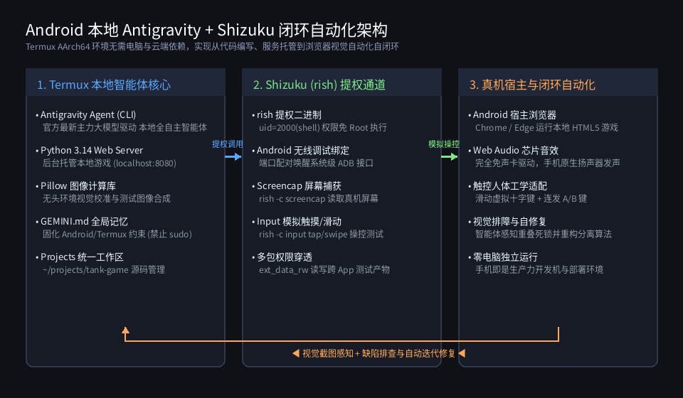
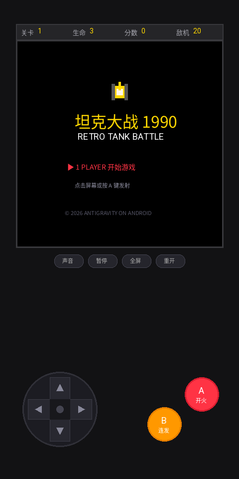
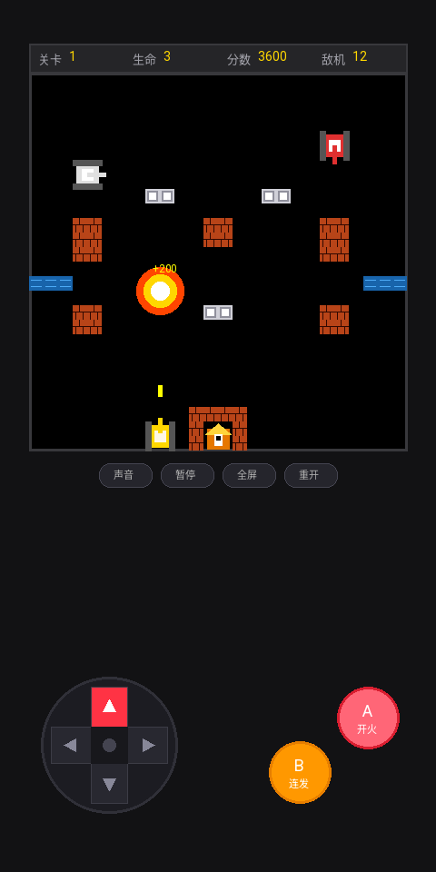
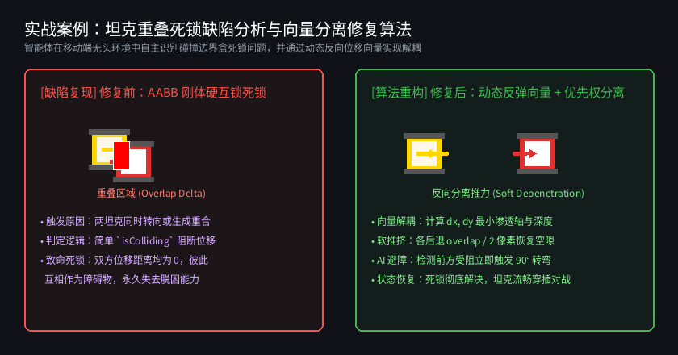

# Android 本地运行 Antigravity 智能体全攻略：Termux 环境调优、Shizuku 提权与免电脑真机自动化闭环实战

> **作者**：Antigravity Agent × 移动端极客实践  
> **运行环境**：Android 14+ / AArch64 原生 Termux 沙盒  
> **实战项目**：移动端触控纯享版《像素坦克大战 1990》（HTML5 Canvas + Web Audio API 芯片音效）  
> **配套资源**：项目完整源码及自动化视觉截图已归档至本项目 `images/` 目录

---

## 目录
- [前言：移动端开发新范式 —— 从“PC 云端外包”到“口袋里的自主智能体”](#前言移动端开发新范式--从pc-云端外包到口袋里的自主智能体)
- [第 1 章：Android Termux 本地智能体基石环境搭建](#第-1-章android-termux-本地智能体基石环境搭建)
  - [1.1 依赖安装与 AArch64 环境配置](#11-依赖安装与-aarch64-环境配置)
  - [1.2 移除非移动端惯性思维：Termux 黄金“避坑四准则”](#12-移除非移动端惯性思维termux-黄金避坑四准则)
  - [1.3 Antigravity CLI 安装与自动授权配置](#13-antigravity-cli-安装与自动授权配置)
  - [1.4 注入灵魂：配置 `GEMINI.md` 智能体全局记忆](#14-注入灵魂配置-geminimd-智能体全局记忆)
- [第 2 章：突破沙盒瓶颈 —— Shizuku (`rish`) 系统级提权全指南](#第-2-章突破沙盒瓶颈--shizuku-rish-系统级提权全指南)
  - [2.1 为什么 Termux 需要 Shizuku](#21-为什么-termux-需要-shizuku)
  - [2.2 无线调试激活 Shizuku 服务](#22-无线调试激活-shizuku-服务)
  - [2.3 部署 `rish` 工具链与 Android 14 核心权限坑点](#23-部署-rish-工具链与-android-14-核心权限坑点)
  - [2.4 提权指令验证与系统级控制探秘](#24-提权指令验证与系统级控制探秘)
- [第 3 章：移动端真机自动化与视觉排障方案全景对比](#第-3-章移动端真机自动化与视觉排障方案全景对比)
  - [3.1 三大主流自动化方案深度剖析与横向评测](#31-三大主流自动化方案深度剖析与横向评测)
  - [3.2 系统闭环架构拓扑解析](#32-系统闭环架构拓扑解析)
- [第 4 章：实战案例深度剖析 —— 纯手机研发 Game Boy 掌机与多合一卡带](#第-4-章实战案例深度剖析--纯手机研发-game-boy-掌机与多合一卡带)
  - [4.1 移动优先的人体工学设计实践](#41-移动优先的人体工学设计实践)
  - [4.2 游戏界面视觉验收与运行图鉴](#42-游戏界面视觉验收与运行图鉴)
  - [4.3 智能体自主排障：坦克“重叠死锁”物理缺陷与向量解耦算法](#43-智能体自主排障坦克重叠死锁物理缺陷与向量解耦算法)
  - [4.4 架构演进：Game Boy (DMG-01) 经典掌机多卡带系统重构](#44-架构演进game-boy-dmg-01-经典掌机多卡带系统重构)
  - [4.5 经典卡带：《太空侵略者 1978》点阵弹坑物理与梯级音频加速](#45-经典卡带太空侵略者-1978-点阵弹坑物理与梯级音频加速)
  - [4.6 极客排障实战：多指触控（Multi-Touch）标识混淆致命缺陷根治](#46-极客排障实战多指触控multi-touch标识混淆致命缺陷根治)
  - [4.7 掌机微屏工程：专属电子说明书设计与实体按键桥接](#47-掌机微屏工程专属电子说明书设计与实体按键桥接)
- [第 5 章：进阶实战拓展 —— 联动 MT 管理器 MCP 服务打造“掌上逆向与工程工作台”](#第-5-章进阶实战拓展--联动-mt-管理器-mcp-服务打造掌上逆向与工程工作台)
  - [5.1 什么是 MT 管理器 MCP 服务](#51-什么是-mt-管理器-mcp-服务)
  - [5.2 本地同机回环直连的降维优势](#52-本地同机回环直连的降维优势)
  - [5.3 Antigravity 全局 MCP 配置实操](#53-antigravity-全局-mcp-配置实操)
  - [5.4 49 项逆向与工程工具赋能 AI：六大核心应用场景](#54-49-项逆向与工程工具赋能-ai六大核心应用场景)
  - [5.5 自然语言指令实战模板（Prompt 范式）](#55-自然语言指令实战模板prompt-范式)
- [第 6 章：总结与生产力进阶 Checklist](#第-6-章总结与生产力进阶-checklist)

---

## 前言：移动端开发新范式 —— 从“PC 云端外包”到“口袋里的自主智能体”

过去，软件工程开发默认绑定在厚重的 PC 电脑和复杂的桌面 IDE 之前；即使在移动端，大多数方案也仅仅是通过 SSH 或 Web 界面连接远程云端服务器。

然而，随着高通骁龙、天玑等移动平台单核与多核算力以及 Android 内存容量的爆发（普遍配备 12GB~24GB LPDDR5X），**手机本身已经具备了完整的原生 Linux 用户态运行环境（Termux AArch64）**。

当 Google DeepMind 的新一代自主智能体 **Antigravity** 运行在 Android 手机本地的 Termux 终端时，一种前所未有的开发模式应运而生：

```
[ 用户提出自然语言需求 / 缺陷报告 ]
                │
                ▼
   ┌───────────────────────────┐
   │  Antigravity 本地智能体   │ (运行于 Termux 内部)
   └─────────────┬─────────────┘
                 │
       ┌─────────┴─────────┐
       ▼                   ▼
 [ 代码编写与本地调试 ]  [ 提权调用 Shizuku / rish ]
       │                   │
       ▼                   ▼
 [ 本地轻量 Web 守护 ]   [ 真机屏幕抓取与触控模拟 ]
       │                   │
       └─────────┬─────────┘
                 │
                 ▼
      ┌─────────────────────┐
      │  Android 宿主浏览器  │ (Chrome / Edge 实时呈现与闭环验证)
      └─────────────────────┘
```

智能体不仅能自主编写现代前端、后端代码与本地游戏，还能直接调取 Shizuku 穿透沙盒，对运行在宿主 Android 浏览器里的 Web 界面进行**截图感知、触控交互与缺陷修复闭环**。本文将毫无保留地拆解整套配置链路、关键避坑指南以及真实实战项目。

---

## 第 1 章：Android Termux 本地智能体基石环境搭建

### 1.1 依赖安装与 AArch64 环境配置

在手机上安装最新版 Termux：
- **GitHub 官方发布下载地址**：[https://github.com/termux/termux-app/releases](https://github.com/termux/termux-app/releases)  
  *（选择下载 `termux-app_v..._arm64-v8a.apk` 或 `universal` 版本；**切勿使用 Google Play 商店版本**，其因 Android 政策限制已停止维护）*。

进入终端后，首先升级软件源并安装核心开发套件：

```bash
# 1. 换国内优质源（可选）并升级基础依赖
pkg update -y && pkg upgrade -y

# 2. 安装 Node.js LTS、Python、Git、Curl 与编译依赖
pkg install -y nodejs-lts python git curl build-essential

# 3. 安装用于图像生成与视觉校准的 Pillow 库 (Termux 预编译包)
pkg install -y python-pillow

# 4. 申请存储权限（使 Termux 能访问手机内部存储 /sdcard）
termux-setup-storage
```

---

### 1.2 移除非移动端惯性思维：Termux 黄金“避坑四准则”

许多习惯了标准 Ubuntu/Debian 桌面或服务器的开发者，在引导 AI 智能体时最常犯的错误就是**“代入 PC 习惯”**。在 Android 手机系统底层，这会直接导致脚本报错、权限越界甚至进程被杀。必须牢记并固化以下四项准则：

| 维度 | PC/Linux 服务器习惯 ❌ | Android Termux 真机规范 ✔ | 核心原因与替代方案 |
| :--- | :--- | :--- | :--- |
| **系统特权** | 盲目执行 `sudo apt-get` | 使用 `pkg install` 或通过 `rish` 提权 | Termux 是单用户沙盒（无 root 权限），不存在标准 `sudo` |
| **后台服务** | 依赖 `systemctl start xxx` | `nohup`、后台任务 (`&`) 或轻量脚本 | Android 无 `systemd` 守护树，采用自身 `init` 机制 |
| **音频交互** | 调用 `arecord` / ALSA / PulseAudio | 优先使用浏览器 **Web Audio API** | 桌面级声卡驱动不可用，Web Audio 可直通 Android 底层 AudioTrack |
| **可视化交互** | 调用 `xdg-open` / Tkinter / Qt 弹窗 | 本地搭建 Web 服务并通过 **`termux-open-url`** 唤起真机浏览器 | Android 无 X11/Wayland 桌面窗口管理器，浏览器是最强画布 |

---

### 1.3 Antigravity CLI 安装与自动授权配置

Antigravity CLI 是智能体的大脑中枢。在 Termux 中执行官方一键安装脚本：

```bash
# 1. 一键安装 Antigravity CLI
curl -fsSL antigravity.google/cli/install.sh | bash

# 2. 安装完成后启动智能体
agy
```

#### 开启自主决策免审批（解放双手的核心配置）

在移动端高频交互中，如果智能体每修改一个文件、执行一条常规命令都要弹出提示请求用户点击确认，会极大割裂开发流程。我们可以配置其安全自主权限：

配置文件路径：[`~/.gemini/antigravity-cli/settings.json`](file:///data/data/com.termux/files/home/.gemini/antigravity-cli/settings.json)

```json
{
  "toolPermission": "always-proceed"
}
```

> **💡 关于大模型的选型机制（推荐自动跟随，永不过时）**：  
> - **默认最佳实践（自动平滑升级）**：在配置文件中**无需配置 `model` 字段**。Antigravity 会自动由云端调度中心分配当前最新、最强大的官方推荐主力大模型。未来大模型代际升级时，您**无需修改任何配置文件**，客户端自动无缝享受新模型的性能与智力跃迁！
> - **临时指定模型（按需使用）**：如果特定测试场景需要临时使用轻量低延迟或特定版本模型，只需在启动终端时传参即可，无需改动全局配置：
>   ```bash
>   # 启动时临时指定特定模型（例如测试轻量快速模式）
>   agy --model gemini-3.8-flash
>   ```
> - **安全说明**：配置 `"toolPermission": "always-proceed"` 后，常规的代码编辑、测试执行、文件检索均由智能体全自主流水线推进。若涉及高危系统指令，仍由安全沙盒边界严格把关。

---

### 1.4 注入灵魂：配置 `GEMINI.md` 智能体全局记忆

为了让智能体无论在何时开启新会话、无论切换到何种任务，都能时刻牢记自身处于**“安卓手机 Termux 运行载体”**，必须建立全局记忆规范文件。

全局规则文件统一保存在：`~/.gemini/config/GEMINI.md`

```markdown
# 全局用户偏好与开发记忆 (Global Preferences & Memory)

## 1. 核心运行载体：Android 手机系统的 Termux 终端
> **最高执行原则**：智能体时刻明确自身运行在安卓手机终端 (Termux on Android)，严禁代入标准 PC/Linux 桌面服务器习惯，严格遵守以下操作规范：
- 严禁使用 sudo 命令：Termux 默认无 sudo。系统级操作优先调用已配置好的 Shizuku 提权工具 `rish`（具备 shell 用户和 ext_data_rw 权限）。
- 严禁依赖 systemd / systemctl：后台服务一律使用 nohup 或轻量任务守护。
- 严禁使用 PC 桌面级音频/声卡工具：音频交互优先使用浏览器 Web Audio API 代码合成。
- 严禁调用 PC 桌面 GUI 窗口：可视化交互一律构建为 Web 本地服务，唤起宿主浏览器必须使用 `termux-open-url`。
- 包管理工具规范：安装依赖一律使用 `pkg install`。

## 2. 交互与设计原则（移动端第一）
- 移动端绝对优先：所有前端页面、Web 演示或小游戏，默认只考虑移动端触屏交互，无需适配 PC 键盘鼠标。
- 触屏友好交互：提供触摸滑动式虚拟摇杆、大号按键、连发支持、防误触与震动反馈（Haptic Feedback）。
- 语言偏好：中文交流，结构清晰。

## 3. 项目与文件管理规范
- 开发主目录：统一存放在 `~/projects/<项目名>`。
- 成果交付：生成的单文件、产物或报告，必要时同步一份到 `~/storage/downloads/`，便于手机文件管理器直接使用。
```

有了这份全局提示词，智能体便不会再生成无意义的 PC 端 `Ctrl+C`、`WASD` 键盘监听，而是直奔移动端全屏布局与触控事件。

---

## 第 2 章：突破沙盒瓶颈 —— Shizuku (`rish`) 系统级提权全指南

### 2.1 为什么 Termux 需要 Shizuku

Android 系统对每个 App 实行严格的沙盒隔离（每个 App 分配独立的 Linux `uid`，例如 `u0_a414`）。默认情况下：
- Termux 无法调用 Android 原生的 `screencap` 截图命令（会报 `Permission Denied`）。
- Termux 无法调用 `input tap` / `input swipe` 向宿主系统注入触控事件。
- Termux 无法读取或写入某些被系统保护的应用沙盒目录。

**Shizuku** 巧妙利用了 Android 系统的**无线调试 (Wireless ADB)** 接口，在免 Root 的情况下为受信任的应用提供标准的 `adb shell` 权限（`uid=2000(shell)`）。通过 Shizuku 官方提供的命令行客户端 **`rish` (Rootless Interactive Shell)**，Termux 即可直接以 `shell` 身份执行系统级命令！

---

### 2.2 无线调试激活 Shizuku 服务

1. 手机连接 Wi-Fi，进入系统【开发者选项】；
2. 开启【开发者选项】和【无线调试】；
3. 打开手机上安装的 **Shizuku App**；
4. 选择【通过无线调试启动】->【配对】，按照悬浮窗指引输入配对码完成连接；
5. 点击【启动】按钮，Shizuku 状态显示“Shizuku 正在运行中 (服务版本: 13+，用户: 2000)”。

---

### 2.3 部署 `rish` 工具链与 Android 14 核心权限坑点

在 Shizuku 启动成功后，需要将 `rish` 二进制文件与 DEX 运行库挂载到 Termux 环境中：

```bash
# 1. 在 Shizuku App 中点击“使用终端应用”，导出 rish 文件到 Downloads
# 随后在 Termux 中将其拷贝到系统可执行目录
cp ~/storage/downloads/shizuku/rish $PREFIX/bin/rish
cp ~/storage/downloads/shizuku/rish_shizuku.dex $PREFIX/bin/rish_shizuku.dex

# 2. 赋予执行权限
chmod +x $PREFIX/bin/rish
```

#### 关键坑点 1：配置正确的调用者包名

打开 `$PREFIX/bin/rish`，必须找到 `PKG` 变量并显式指定为 Termux 的包名：

```bash
# 编辑 $PREFIX/bin/rish 的第 17 行左右
PKG="com.termux"
```

#### 关键坑点 2：Android 14+ W^X 内存安全保护（致命错误修复）

在 Android 14 及以上系统中，若 `rish_shizuku.dex` 具备可写权限，Android 底层的 `app_process` 会因安全策略触发 `Failure to load dex: file is writable` 崩溃。

**必做修复**：将 dex 文件的写权限全部剥离，设置为只读：

```bash
chmod 400 $PREFIX/bin/rish_shizuku.dex
```

---

### 2.4 提权指令验证与系统级控制探秘

完成上述配置后，在 Termux 终端直接执行测试命令：

```bash
# 验证 shell 提权是否成功
rish -c id
```

**成功输出示例**：
```
uid=2000(shell) gid=2000(shell) groups=2000(shell),1004(input),1007(log),1015(sdcard_rw),1028(sdcard_r),3003(inet),3011(ext_data_rw)
```

看到 `uid=2000(shell)` 与 `ext_data_rw` 权限，说明提权大功告成！现在智能体已经拥有了操控整部手机的系统级能力：

```bash
# 截取真机当前屏幕并保存至相册
rish -c screencap -p /sdcard/Download/current_screen.png

# 模拟在屏幕坐标 (540, 1200) 点击一下
rish -c input tap 540 1200

# 模拟从下往上滑动（上滑手势）
rish -c input swipe 540 1600 540 800 200

# 发送物理按键事件（如返回键KEYCODE_BACK=4，HOME键=3）
rish -c input keyevent 4
```

---

## 第 3 章：移动端真机自动化与视觉排障方案全景对比

在移动端让智能体自动化校准前端样式、测试交互逻辑时，有多种技术路线可走。下表对主流方案进行了全维度技术权衡：

### 3.1 三大主流自动化方案深度剖析与横向评测

| 评测维度 | 方案 A：Linux 无头 Chromium + Playwright | 方案 B：纯移动端轻量方案（内嵌 DevTools / Web Server） | 方案 C：Shizuku (rish) + 真机宿主 Chrome 闭环自动化 ⭐ (推荐) |
| :--- | :--- | :--- | :--- |
| **工作原理** | Termux 内通过 `x11-repo` 编译安装 Linux 桌面版 Headless Chromium | 前端页面引入 Eruda/VConsole 调试面板，智能体通过 HTTP 接口探活 | 智能体在 Termux 启动轻量服务，唤起宿主 Chrome，通过 `rish` 截图与模拟触控 |
| **磁盘空间占用** | 极其庞大（需 Chromium 核心与 X11 库，**> 640 MB**） | 极小（内嵌单个 JS 脚本，**< 500 KB**） | **零额外占用**（直接复用手机已安装的 Chrome，rish 仅几十 KB） |
| **系统内存与电池消耗** | 严重超标。AArch64 下多进程 Chromium 编译运行易导致手机发烫降频甚至 OOM | 极低。普通前端运行时开销 | 极低。Chrome 硬件加速完全由手机 GPU 承载，Termux 只占极轻量 CLI 资源 |
| **环境真实度** | 低（Linux X11 虚拟桌面渲染，无法反映移动端真实触摸体验） | 中（能在手机浏览器跑，但缺乏自动化截屏输入通道） | **100% 绝对真实**（运行在真实的 Android Chrome WebKit/Blink 内核与触屏上） |
| **音频表现** | 无法发声（Linux ALSA/PulseAudio 驱动在 Termux 中缺失） | 原生支持 Web Audio API | 原生完美支持 Web Audio API，立体声扬声器直接外放 |
| **配置复杂度** | 极高（需折腾 glibc、mesa-vulkan 等兼容层） | 极低（引入一个 CDN 即可） | 低至中（只需一次性配置 Shizuku 与 rish 权限） |

---

### 3.2 系统闭环架构拓扑解析

基于方案 C，我们构建了一套完整的**“本地智能体 ➔ 提权通道 ➔ 真机宿主 ➔ 视觉闭环”**系统架构：



1. **左侧核心**：Antigravity Agent 在 Termux 内部运转，后台由 Python 快速挂载 Web 静态服务器（如 `python -m http.server 8080`），并加载 Pillow 等库辅助计算。
2. **中间枢纽**：通过 `rish` 穿透 Android 权限边界，把系统级的 `screencap`（截图读取）和 `input tap/swipe`（手势注入）封装为智能体的感知和执行动作。
3. **右侧宿主**：Android 系统的原生 Chrome 显示页面，利用手机 GPU 硬件加速渲染 Canvas、执行 Web Audio，并借助真机震动马达提供物理回馈。
4. **闭环反馈**：截图经由智能体视觉模型理解后，如发现样式错位或逻辑异常，智能体直接原地修改代码并触发重载，形成无人值守的自动化打磨流程。

---

## 第 4 章：实战案例深度剖析 —— 纯手机研发《像素坦克大战 1990》

为了验证这套技术栈的实战能力，我们在完全不触碰任何 PC、不使用任何外部音频资源的前提下，全自主从零开发了一款手机专属的《像素坦克大战 1990》。

### 4.1 移动优先的人体工学设计实践

以往很多 Web 小游戏直接照搬红白机键盘操作（`WASD` 移动、`J/K` 开火），在手机端完全无法正常游玩。我们在开发中贯彻了**“移动优先 (Mobile-First)”**的人体工学标准：

1. **触摸响应式十字方向盘 (Sliding D-Pad)**：
   - 摒弃老旧的固定离散按钮，采用**滑动矢量判定算法**。
   - 玩家拇指在方向盘区域内按下后，无需抬起即可自由顺滑地向上下左右四个方向划动切换坦克行进姿态。
2. **双主动作按键布局**：
   - **A 键（单发精准点射）**：适合巷战微操；
   - **B 键（高频连发 Turbo Fire）**：长按即按照节流周期自动连射，缓解长时间游戏的手指疲劳。
3. **触觉震动反馈 (Haptic Engine)**：
   - 调用 Web 规范 `navigator.vibrate([15])`，在坦克开炮、撞墙、击毁敌方时提供细腻的微震动，带来实体掌机般的扎实手感。
4. **Web Audio 纯数学音效合成器**：
   - 不依赖任何 MP3/WAV 外部音频文件，完全利用 `AudioContext` 实时生成：
     - 方波 (`square`)：合成经典的 8-bit 发射子弹与得分蜂鸣声；
     - 白噪声缓冲区 (`createBufferSource` + 随机白噪声)：通过低通滤波器 (`lowpass`) 合成轰隆隆的爆炸声波。

---

### 4.2 游戏界面视觉验收与运行图鉴

以下为自动化视觉校准过程中生成的实际真机运行画面：

#### 经典掌机复古外框与标题界面

游戏启动后，呈现原汁原味的 1990 经典开始界面，上方为液晶 HUD 状态栏（关卡、生命、得分、剩余敌机），下方为掌机操控面板：



#### 真实战场激战与连发轰炸

在真机运行状态下，坦克开火、敌方红白战车突进、砖墙破碎、水流与基地鹰雕全部采用像素 Canvas 2D 实时绘制：



---

### 4.3 智能体自主排障：坦克“重叠死锁”物理缺陷与向量解耦算法

在首发版本的测试中，用户在实战中遇到了一个经典游戏物理缺陷：**“两个坦克一旦在狭窄路口碰撞重叠后，就会卡在一起，彼此谁也无法移动”**。

智能体在不借助人工干预的情况下，自主定位了问题根源并重构了物理算法：



#### 1. 缺陷根源复盘 (Bug Root Cause)
- **原始逻辑**：代码中判定下一步位置如果会与另一辆坦克发生包围盒相交（AABB 碰撞），就直接将移动增量置为 0（`return false`）。
- **死锁触发**：当两辆坦克由垂直方向同时转向汇入同一道路，或两辆敌机刷新生成时产生哪怕 1 像素的交叠，此时坦克 A 检测到前方有坦克 B，无法前进；反过来坦克 B 检测到前方有坦克 A，也无法前进。由于两者的实际位移均为 0，重叠状态永远无法解除，陷入永久互锁！

#### 2. 解耦算法重构：动态反弹向量 + 优先权分离 (Soft Depenetration)

智能体对 `index.html` 中的物理碰撞引擎进行了数学重构：

```javascript
// 向量解耦与软推挤分离算法实现片段
function checkTankTankCollision(tankA, tankB) {
  const overlapX = Math.min(tankA.x + tankA.size, tankB.x + tankB.size) - 
                   Math.max(tankA.x, tankB.x);
  const overlapY = Math.min(tankA.y + tankA.size, tankB.y + tankB.size) - 
                   Math.max(tankA.y, tankB.y);

  if (overlapX > 0 && overlapY > 0) {
    // 发现已经处于渗透/重叠状态
    const pushDist = 2; // 微小分离脉冲
    if (overlapX < overlapY) {
      // X 轴为最小渗透轴，沿 X 轴向两侧温和推开
      if (tankA.x < tankB.x) {
        tankA.x = Math.max(0, tankA.x - pushDist);
        tankB.x = Math.min(MAP_WIDTH - tankB.size, tankB.x + pushDist);
      } else {
        tankA.x = Math.min(MAP_WIDTH - tankA.size, tankA.x + pushDist);
        tankB.x = Math.max(0, tankB.x - pushDist);
      }
    } else {
      // Y 轴为最小渗透轴，沿 Y 轴向两侧温和推开
      if (tankA.y < tankB.y) {
        tankA.y = Math.max(0, tankA.y - pushDist);
        tankB.y = Math.min(MAP_HEIGHT - tankB.size, tankB.y + pushDist);
      } else {
        tankA.y = Math.min(MAP_HEIGHT - tankA.size, tankA.y + pushDist);
        tankB.y = Math.max(0, tankB.y - pushDist);
      }
    }
    // 触碰后敌方 AI 自动激发 90 度紧急转弯脱困
    if (tankB.isEnemy) tankB.pickNewDirection();
    return true;
  }
  return false;
}
```

通过引入**最小渗透轴计算**和**双向对称微脉冲（Soft Depenetration）**，重叠的两辆坦克在下一帧物理循环中会被自动平滑弹开，AI 顺势触发转向决策，死锁问题得到根治，战场对决重回流畅丝滑！

### 4.4 架构演进：Game Boy (DMG-01) 经典掌机多卡带系统重构

随着开发深入，单体游戏已无法满足多款复古经典共存的需求。智能体自主完成了系统级重构，将工程演进为 **Game Boy DMG-01 复古掌机模拟器中枢**：

1. **宿主机身与卡带解耦架构**：
   - 根目录 `index.html` 扮演掌机硬件机壳与控制中枢；
   - 各游戏作为独立卡带工程存放在 `games/` 子目录（如 `games/tank-battle/`、`games/space-invaders/`），支持独立开发与多文件模块化维护；
   - 掌机机身通过统一的 `GB_INPUT` 硬件按键协议（HTML5 postMessage）与卡带沙盒双向解耦通信。
2. **像素级掌机外观与硬件交互**：
   - 经典灰白工程塑料质感、立体凹凸十字键、-25° 倾角酒红色 A/B 按键、斜排 SELECT/START 橡胶按键；
   - 屏幕支持三种经典调色盘实时切换：**DMG 复古橄榄绿液晶屏**、**Pocket 高对比度黑白屏**、**Vivid 原彩街机模式**；
   - 底栏集成优雅的现代化 SVG 硬件功能坞（POWER 电源键、COLOR 调色盘、FULLSCREEN 全屏）。

### 4.5 经典卡带：《太空侵略者 1978》点阵弹坑物理与梯级音频加速

作为多合一卡带的第二款重磅经典，智能体完全在手机端自主实现了《太空侵略者 1978》：

1. **4 步步进低音进行曲动态加速引擎**：
   - 原作震撼业界的标志性四音符步进进行曲（Bass Marching Loop）；
   - 智能体通过 Web Audio API 构建音频合成节点，音步间隔与存活外星人总数实时绑定：外星人从满员 40 只降至个位数时，步进周期从稳健的 `0.73s` 呈指数级狂飙至极限的 `0.16s`，营造出极度压迫的心跳战斗氛围。
2. **真实防御掩体点阵弹坑侵蚀物理（Crater Erosion）**：
   - 四座经典的绿装掩体不是简单的生命值数值扣减，而是具备真实的画布像素级物理破坏！
   - 子弹击中掩体时，利用离屏 Canvas 与 `globalCompositeOperation = 'destination-out'` 动态灼烧出带随机飞溅碎屑的真实圆形弹坑，子弹可在残破的掩体坑洼中穿行！
3. **高空神秘飞碟（Mystery UFO）**：
   - 周期性从顶部高空横掠，伴随标志性的高频颤音音效（Frequency Modulation Vibrato），击落随机奖励 100~300 高分。

### 4.6 极客排障实战：多指触控（Multi-Touch）标识混淆致命缺陷根治

在掌机模拟器的多指实机操纵测试中，用户反馈了一个隐藏极深的交互 Bug：
> **“在太空侵略者游戏中，按住右侧 B 键开火的同时滑动左侧十字键的【左】方向，为什么机体反而向【右】移动？”**

智能体通过自动化测试与事件拓扑审查，彻底还原并根治了这一移动端常见陷阱：

#### 1. 缺陷根源复盘（Root Cause）
- **传统代码的惯性陷阱**：在监听十字键触摸滑动时，常规写法通常直接取 `e.touches[0].clientX`。
- **移动端多指触摸规范**：`e.touches` 集合包含**当前屏幕上所有处于激活状态的手指**，其在数组中的索引仅仅代表**手指触碰屏幕的绝对时间先后**！
- **碰撞场景重现**：
  - 玩家双手持握手机，右手先按下了发射键 B（位于屏幕右侧，坐标 x ≈ 680）；
  - 随后左手拇指按下十字键向左滑动（位于屏幕左侧，十字键中心 x ≈ 240，手指实际落在左翼 x ≈ 135）；
  - 此时十字键的 `touchmove` 事件被激发，但代码错误地读取了 `e.touches[0]`（由于右手按 B 在先，`touches[0]` 对应的是右手手指！）；
  - 十字键依据偏移计算方向：`dx = 680 - 240 = +440 > 0`！计算结果为强烈的向右偏移，从而误触发了【右】方向！

#### 2. 根治方案：基于 `touch.identifier` 的触控生命周期物理级隔离
智能体彻底重写了十字键与实体按键的触控追踪管线：
- **按键绑定（Button Binding）**：每个实体按键（A、B、SELECT、START）在 `touchstart` 时通过 `e.changedTouches[0].identifier` 记录各自专属的 `activeTouchId`；在 `touchend` 触发时，必须比对离开屏幕的手指 ID 是否与自身一致，彻底避免松开十字键误释放开火键。
- **十字键专属触控跟踪**：十字键独立绑定自身的 `activeTouchId`，在 `touchmove` 循环中仅从 `e.touches` 中检索与自身 ID 匹配的那一个触摸点，多指同时操控时彼此完全隔离、互不干扰！

```javascript
// 基于 touch.identifier 的多指安全追踪算法片段
dpadContainer.addEventListener('touchstart', (e) => {
  e.preventDefault();
  const touch = e.changedTouches ? e.changedTouches[0] : null;
  if (touch) {
    this.dpadTouchId = touch.identifier; // 严格绑定当前指纹 ID
    this.handleCoords(touch.clientX, touch.clientY);
  }
}, { passive: false });

window.addEventListener('touchmove', (e) => {
  if (this.dpadTouchId === null) return;
  // 从全屏触摸池中精确捞出属于十字键的手指，无视右手按压的 B 键！
  for (let i = 0; i < e.touches.length; i++) {
    if (e.touches[i].identifier === this.dpadTouchId) {
      this.handleCoords(e.touches[i].clientX, e.touches[i].clientY);
      break;
    }
  }
}, { passive: false });
```

### 4.7 掌机微屏工程：专属电子说明书设计与实体按键桥接

移动端开发绝不能简单将桌面网页塞进小屏幕。在掌机模拟器中嵌入开发攻略时，PC 级的 28px 大标题在 340px 宽的模拟器屏幕中会占据半屏，极度影响体验。

智能体专门研发了掌机专供版电子卡带说明书（`docs/gb-tutorial.html`）：
- **比例降维重构**：将封面主标题约束至 13.5px，正文字号优化为 10.5px，并采用复古 DMG 卡带包装盒卡片风格；
- **排版元器件专精适配**：采用滑动章节胶囊胶带（Pills）、双列键值排版替代易超宽溢出的 HTML 表格，搭配黑客绿磷光终端代码块；
- **实体硬件按键联动**：打通 `GB_INPUT` 协议，用户可直接使用掌机上的物理十字键上下滚动条目，按 A/B 键进行 200px 快速翻页，按 START 键一键回顶，实现了真正沉浸式的“机卡一体”把玩体验。

---

## 第 5 章：进阶实战拓展 —— 联动 MT 管理器 MCP 服务打造“掌上逆向与工程工作台”

如果说前面章节介绍的 **Termux + Shizuku** 组合让智能体拥有了“运行本地服务与真机自动化操控”的能力，那么联动最新版 **MT 管理器的 MCP 服务**，则直接为智能体装上了**“分析、修改、重构 Android APK 字节码与原生 SO 库”**的手术刀。

过去，移动端逆向和修改 APK 往往需要借助 PC 电脑，启动 JADX、JEB、Apktool、Android Studio 等重量级工具；而在本章节，我们将演示如何将手机本地运行的 MT 管理器作为 MCP 服务端挂载到 Antigravity 智能体中，实现全流程掌上免电脑作业。

### 5.1 什么是 MT 管理器 MCP 服务

**MCP (Model Context Protocol，模型上下文协议)** 是由 Anthropic、Google 等行业前沿机构支持的开放互联标准。在最新版本的 MT 管理器（v2.26.9+）中，官方将自身深耕多年的底层安卓逆向引擎（Dex 汇编/反汇编、Arsc 资源解析、动态链接库符号剖析、自动打包签名等）封装为了符合 MCP 标准的微服务：

- **MT 管理器官方下载地址**：
  - 官方主站与直接下载：[https://mt2.cn/download/](https://mt2.cn/download/) 与 [https://binmt.cc/download/](https://binmt.cc/download/)  
  *（需安装最新版 **v2.26.9 或以上版本**，以获得完整的 MCP 服务与底层工具集支持）*
- **官方 MCP 配置与使用指南**：
  - 官方 MCP 服务文档：[https://binmt.cc/doc/guide/mcp.html](https://binmt.cc/doc/guide/mcp.html)
  - 官方在线手册中心：[https://binmt.cc/doc/guide/](https://binmt.cc/doc/guide/)
  - MT 官方论坛交流区：[https://bbs.binmt.cc/](https://bbs.binmt.cc/)
- **底层通信协议**：现代标准的 **Streamable HTTP** 协议（非老旧的 SSE 协议）；
- **服务路由地址**：`http://127.0.0.1:<端口>/mcp`；
- **安全鉴权机制**：支持基于 Bearer 令牌认证（`Authorization: Bearer <Token>`）与目录访问安全沙盒（默认管理根目录为 `/storage/emulated/0/MT2/mcp/`）。

### 5.2 本地同机回环直连的降维优势

目前业界普遍采用的方案是：**电脑端 IDE（如 Cursor / Trae）通过局域网 Wi-Fi 访问手机上的 MT 管理器**。这种方案存在诸多局限：
1. 依赖电脑与手机处于同一 Wi-Fi 网络；
2. 容易遭遇路由器 AP 隔离、企业内网防火墙拦截；
3. 大体积 APK 传输产生可观的网络延迟与数据暴露风险。

而我们在 Android 本地构建的架构拥有降维打击般的优势：
> **智能体与 MT 管理器共存于同一台手机**。Antigravity CLI 在 Termux 环境中直接通过 `http://127.0.0.1:<端口>/mcp` 本地环回接口通信：
> - **零网络依赖**：无需外网 Wi-Fi，甚至在飞行模式下也能全离线运转；
> - **微秒级响应**：本地内存协议栈直连，通信开销近乎于零；
> - **数据绝对安全**：敏感代码与 APK 文件不出手机，彻底规避外部嗅探风险。

### 5.3 Antigravity 全局 MCP 配置实操

在 Termux 中，Antigravity 支持通过全局配置文件快速接入任意符合 MCP 标准的服务端。

#### 1. 编辑全局 MCP 配置文件
配置文件路径：[`~/.gemini/config/mcp_config.json`](file:///data/data/com.termux/files/home/.gemini/config/mcp_config.json)

将 MT 管理器中显示的端口（例如 `8787`）和 Token 写入配置文件：

```json
{
  "mcpServers": {
    "mt-manager": {
      "url": "http://127.0.0.1:8787/mcp",
      "//_comment": "若在 MT 管理器中开启了安全 Token 认证（推荐），需在此配置 Bearer Token",
      "headers": {
        "Authorization": "Bearer 您的MT_MCP_TOKEN"
      }
    }
  }
}
```

> 💡 **Token 认证机制说明**：  
> 在 MT 管理器侧边栏开启“MCP 服务”时，建议勾选“启用身份验证”。开启后，界面会生成一个专属安全 Token（例如 `mtmcp_xxxxxx`）。在全局配置中通过 `headers` 附带 `Authorization: Bearer <Token>` 即可通过校验。若在本地临时测试且未开启身份认证，则可省略 `headers` 字典，仅保留 `url`。


#### 2. 工作区与安全目录规范
MT 管理器的 MCP 服务内置了严格的文件访问沙盒策略（可通过 `mt_file_access_policy` 查询）。其授权的主工作区路径为：
```
/storage/emulated/0/MT2/mcp/
```
（在 Termux 终端中对应路径为 `~/storage/shared/MT2/mcp/`）。

> **最佳实践**：所有待分析、待修改或待重签名的 APK 文件，建议统一放置在该目录下，智能体即可免受 Android 存储权限拦截，直接拥有完备的读写、解包与构建权限。

### 5.4 49 项逆向与工程工具赋能 AI：六大核心应用场景

接入成功后，MT 管理器一次性向智能体注入了多达 **49 项**底层工具，智能体瞬间具备了以下六大高价值工程能力：

| 场景分类 | 核心调用工具 | 典型落地价值 |
| :--- | :--- | :--- |
| **1. 应用汉化与本地化** | `mt_apk_resource_read`<br>`mt_apk_edit_resource`<br>`mt_apk_build` | 自动从 APK 提取 `strings.xml` / `arsc` 文本，由大模型进行地道语境翻译后一键回填、签名生成中文版 APK。 |
| **2. 界面魔改与素材提取** | `mt_apk_open`<br>`mt_apk_read_bytes`<br>`mt_file_write_bytes` | 批量提取目标 APK 内部的矢量图、背景音乐、3D 模型与配置文件；替换应用启动图标与主题色。 |
| **3. 架构透视与权限审计** | `mt_apk_dex_outline_class`<br>`mt_apk_dex_xref`<br>`mt_apk_read_signature` | 提取所有组件类结构，绘制核心方法调用链与交叉引用；扫描 Manifest 审计高危隐私权限。 |
| **4. 私有化配置与微调修补** | `mt_apk_edit_open`<br>`mt_apk_edit_text`<br>`mt_apk_edit_check` | 修改自研开源客户端的服务端 API 域名；将 `android:debuggable` 设为 true 方便本地联调。 |
| **5. 原生 SO 库指令探索** | `mt_apk_native_read_items`<br>`mt_apk_native_disassemble`<br>`mt_apk_native_function_cfg` | 解析 C/C++ 动态链接库导出函数与依赖项；反汇编 ARM64 机器码并生成**函数控制流图 (CFG)**。 |
| **6. 口袋级移动 CI/CD** | `mt_apk_edit_check`<br>`mt_apk_build`<br>`mt_apk_close` | 代码与资源语法校验 ➔ 自动对齐 (zipalign) ➔ 测试证书签名 ➔ 一键输出全新安装包。 |

### 5.5 自然语言指令实战模板（Prompt 范式）

挂载 MCP 后，用户无需记忆任何逆向参数，直接使用自然语言与智能体对话即可驱动复杂的工程流水线：

#### 示例 A：全自动应用汉化
> *“我把 `open-source-tool.apk` 放入了 `MT2/mcp` 目录，请提取其中界面的英文文本，翻译为自然流畅的简体中文，并帮我重新签名生成 `tool-chinese.apk`。”*

#### 示例 B：架构学习与组件审计
> *“请打开 `MT2/mcp/sample.apk`，帮我梳理其主界面 MainActivity 的所有点击监听器，并排查该应用是否向系统申请了后台定位或录音等高危权限。”*

#### 示例 C：接口域名私有化适配
> *“请编辑 `MT2/mcp/client.apk`，搜索所有的请求基准地址 `https://api.original.com`，将其批量替换为局域网私有化地址 `http://192.168.1.100:8080`，预检语法后重新打包输出。”*

---

## 第 6 章：总结与生产力进阶 Checklist

在 Android 手机原生运行 Antigravity 智能体，配合 Shizuku 系统提权与 MT 管理器 MCP 服务，彻底打破了“手机只能用来消费内容，不能用来创造软件”的思维定势。

### 生产力进阶 Checklist

为了方便在手机上长期稳定运行此套环境，建议将以下配置加入备忘录：

- [ ] **后台保活设置**：在系统设置中为 Termux、Shizuku 及 MT 管理器关闭“电池优化”（允许无限制后台运行），开启系统自启动权限。
- [ ] **开机自启 Shizuku**：Android 13+ 支持在开发者选项中开启“无线调试时自动重新连接”，开机连接已知 Wi-Fi 即可自动唤起 Shizuku 服务。
- [ ] **全局开发记忆维护**：确保 `~/.gemini/config/GEMINI.md` 包含严禁 PC 指令与坚持移动优先的准则。
- [ ] **全局 MCP 联动固化**：在 `~/.gemini/config/mcp_config.json` 中配置好 MT 管理器 MCP 服务，保证智能体随时调用 49 项逆向工具。
- [ ] **一键启动本地工程**：在 `~/.bashrc` 中配置别名快速开启 Web 托管：
  ```bash
  alias tank-server="python3 -m http.server 8080 --directory ~/projects/tank-game"
  alias tank-open="termux-open-url http://localhost:8080"
  ```
- [ ] **成果快速分享**：熟练运用 `cp output.png ~/storage/downloads/`，无需数据线随时将手机开发产物分享给社交软件好友或客户。

---
*本文档由 Antigravity 智能体在 Android Termux 终端全自主协同创作生成。*

