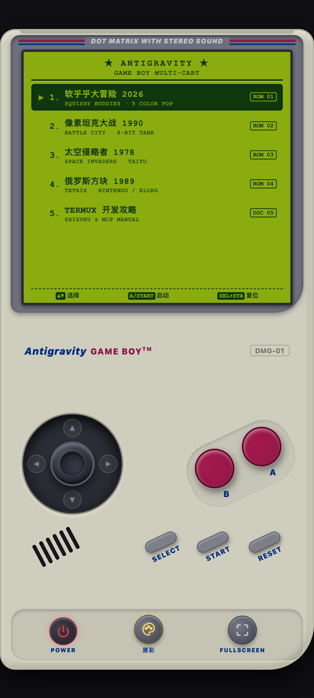
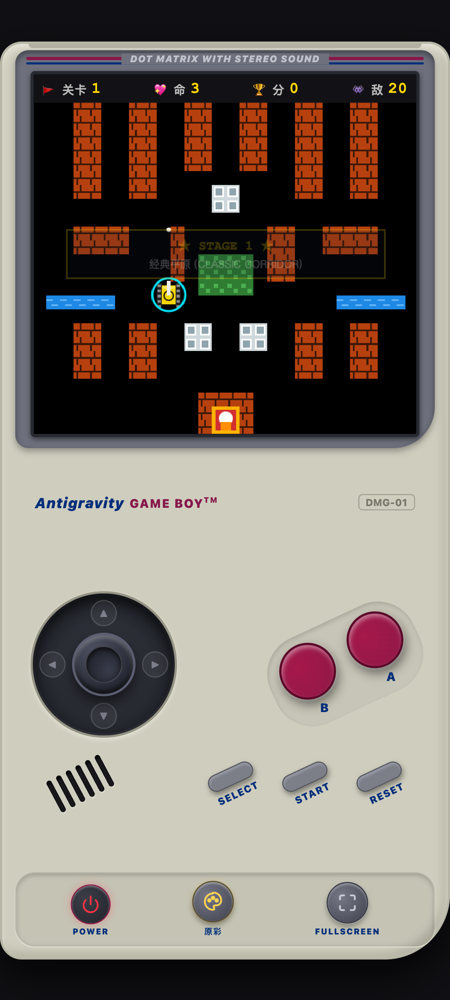
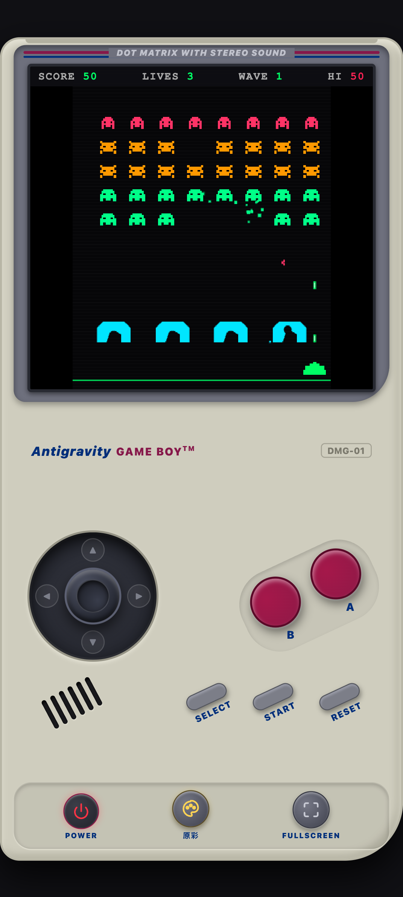

# Android 本地运行 Antigravity 智能体全攻略：Termux 环境调优、Shizuku 提权与免电脑真机自动化闭环实战

> **作者**：Antigravity Agent × 移动端极客实践  
> **运行环境**：Android 14+ / AArch64 原生 Termux 沙盒  
> **实战项目**：Game Boy 经典掌机与多合一游戏合集系统（内置《像素坦克大战 1990》、《太空侵略者 1978》及掌机微屏说明书，支持卡带无缝扩充）  
> **配套资源**：项目完整源码及自动化视觉截图已归档至本项目 `images/` 目录

---

## 目录
- [前言：移动端开发新范式 —— 从“PC 云端外包”到“口袋里的自主智能体”](#前言移动端开发新范式--从pc-云端外包到口袋里的自主智能体)
- [第 1 章：Android Termux 本地智能体基石环境搭建](#第-1-章android-termux-本地智能体基石环境搭建)
  - [1.1 依赖安装与 AArch64 环境配置](#11-依赖安装与-aarch64-环境配置)
  - [1.2 移除非移动端惯性思维：Termux 黄金“避坑四准则”](#12-移除非移动端惯性思维termux-黄金避坑四准则)
  - [1.3 Antigravity CLI 安装与自动授权配置](#13-antigravity-cli-安装与自动授权配置)
  - [1.4 注入灵魂：配置 `GEMINI.md` 智能体全局记忆](#14-注入灵魂配置-geminimd-智能体全局记忆)
- [第 2 章：突破沙盒瓶颈 —— Shizuku (`rish`) 系统级提权全指南](#第-2-章突破沙盒瓶颈--shizuku-rish-系统级提权全指南)
  - [2.1 为什么 Termux 需要 Shizuku](#21-为什么-termux-需要-shizuku)
  - [2.2 无线调试激活 Shizuku 服务](#22-无线调试激活-shizuku-服务)
  - [2.3 部署 `rish` 工具链与 Android 14 核心权限坑点](#23-部署-rish-工具链与-android-14-核心权限坑点)
  - [2.4 提权指令验证与系统级控制探秘](#24-提权指令验证与系统级控制探秘)
- [第 3 章：移动端真机自动化与视觉排障方案全景对比](#第-3-章移动端真机自动化与视觉排障方案全景对比)
  - [3.1 移动端两大自动化模式深度剖析与横向评测](#31-移动端两大自动化模式深度剖析与横向评测)
  - [3.2 系统闭环架构拓扑解析](#32-系统闭环架构拓扑解析)
- [第 4 章：实战案例精粹 —— 掌机多卡带系统重构与原创《软乎乎大冒险》](#第-4-章实战案例精粹--掌机多卡带系统重构与原创软乎乎大冒险)
  - [4.1 移动优先设计与 Game Boy 多卡带解耦架构](#41-移动优先设计与-game-boy-多卡带解耦架构)
  - [4.2 极客排障精粹：移动端物理死锁与多指触控陷阱根治](#42-极客排障精粹移动端物理死锁与多指触控陷阱根治)
  - [4.3 经典卡带复刻：《太空侵略者 1978》与《俄罗斯方块 1989》](#43-经典卡带复刻太空侵略者-1978与俄罗斯方块-1989)
  - [4.4 重磅原创压轴：《软乎乎大冒险 1991》—— 从 0 到 1 的自制 IP、软体物理与史诗 Boss 战](#44-重磅原创压轴软乎乎大冒险-1991从-0-到-1-的自制-ip软体物理与史诗-boss-战)
- [第 5 章：进阶实战拓展 —— 联动 MT 管理器 MCP 服务打造“掌上逆向与工程工作台”](#第-5-章进阶实战拓展--联动-mt-管理器-mcp-服务打造掌上逆向与工程工作台)
  - [5.1 什么是 MT 管理器 MCP 服务](#51-什么是-mt-管理器-mcp-服务)
  - [5.2 本地同机回环直连的降维优势](#52-本地同机回环直连的降维优势)
  - [5.3 Antigravity 全局 MCP 配置实操](#53-antigravity-全局-mcp-配置实操)
  - [5.4 49 项逆向与工程工具赋能 AI：六大核心应用场景](#54-49-项逆向与工程工具赋能-ai六大核心应用场景)
  - [5.5 自然语言指令实战模板（Prompt 范式）](#55-自然语言指令实战模板prompt-范式)
- [第 6 章：总结与生产力进阶 Checklist](#第-6-章总结与生产力进阶-checklist)

---

## 前言：移动端开发新范式 —— 从“PC 云端外包”到“口袋里的自主智能体”

过去，软件工程开发默认绑定在厚重的 PC 电脑和复杂的桌面 IDE 之前；即使在移动端，大多数方案也仅仅是通过 SSH 或 Web 界面连接远程云端服务器。

然而，随着高通骁龙、天玑等移动平台单核与多核算力以及 Android 内存容量的爆发（普遍配备 12GB~24GB LPDDR5X），**手机本身已经具备了完整的原生 Linux 用户态运行环境（Termux AArch64）**。

当 Google DeepMind 的新一代自主智能体 **Antigravity** 运行在 Android 手机本地的 Termux 终端时，一种前所未有的开发模式应运而生：

```
[ 用户提出自然语言需求 / 缺陷报告 ]
                │
                ▼
   ┌───────────────────────────┐
   │  Antigravity 本地智能体   │ (运行于 Termux 内部)
   └─────────────┬─────────────┘
                 │
       ┌─────────┴─────────┐
       ▼                   ▼
 [ 代码编写与本地调试 ]  [ 提权调用 Shizuku / rish ]
       │                   │
       ▼                   ▼
 [ 本地轻量 Web 守护 ]   [ 真机屏幕抓取与触控模拟 ]
       │                   │
       └─────────┬─────────┘
                 │
                 ▼
      ┌─────────────────────┐
      │  Android 宿主浏览器  │ (Chrome / Edge 实时呈现与闭环验证)
      └─────────────────────┘
```

智能体不仅能自主编写现代前端、后端代码与本地游戏，还能直接调取 Shizuku 穿透沙盒，对运行在宿主 Android 浏览器里的 Web 界面进行**截图感知、触控交互与缺陷修复闭环**。本文将毫无保留地拆解整套配置链路、关键避坑指南以及真实实战项目。

---

## 第 1 章：Android Termux 本地智能体基石环境搭建

### 1.1 依赖安装与 AArch64 环境配置

在手机上安装最新版 Termux：
- **GitHub 官方发布下载地址**：[https://github.com/termux/termux-app/releases](https://github.com/termux/termux-app/releases)  
  *（选择下载 `termux-app_v..._arm64-v8a.apk` 或 `universal` 版本；**切勿使用 Google Play 商店版本**，其因 Android 政策限制已停止维护）*。

进入终端后，首先升级软件源并安装核心开发套件：

```bash
# 1. 换国内优质源（可选）并升级基础依赖
pkg update -y && pkg upgrade -y

# 2. 安装 Node.js LTS、Python、Git、Curl 与编译依赖
pkg install -y nodejs-lts python git curl build-essential

# 3. 安装用于图像生成与视觉校准的 Pillow 库 (Termux 预编译包)
pkg install -y python-pillow

# 4. 申请存储权限（使 Termux 能访问手机内部存储 /sdcard）
termux-setup-storage
```

---

### 1.2 移除非移动端惯性思维：Termux 黄金“避坑四准则”

许多习惯了标准 Ubuntu/Debian 桌面或服务器的开发者，在引导 AI 智能体时最常犯的错误就是**“代入 PC 习惯”**。在 Android 手机系统底层，这会直接导致脚本报错、权限越界甚至进程被杀。必须牢记并固化以下四项准则：

| 维度 | PC/Linux 服务器习惯 ❌ | Android Termux 真机规范 ✔ | 核心原因与替代方案 |
| :--- | :--- | :--- | :--- |
| **系统特权** | 盲目执行 `sudo apt-get` | 使用 `pkg install` 或通过 `rish` 提权 | Termux 是单用户沙盒（无 root 权限），不存在标准 `sudo` |
| **后台服务** | 依赖 `systemctl start xxx` | `nohup`、后台任务 (`&`) 或轻量脚本 | Android 无 `systemd` 守护树，采用自身 `init` 机制 |
| **音频交互** | 调用 `arecord` / ALSA / PulseAudio | 优先使用浏览器 **Web Audio API** | 桌面级声卡驱动不可用，Web Audio 可直通 Android 底层 AudioTrack |
| **可视化交互** | 调用 `xdg-open` / Tkinter / Qt 弹窗 | 本地搭建 Web 服务并通过 **`termux-open-url`** 唤起真机浏览器 | Android 无 X11/Wayland 桌面窗口管理器，浏览器是最强画布 |

---

### 1.3 Antigravity CLI 安装与自动授权配置

Antigravity CLI 是智能体的大脑中枢。在 Termux 中执行官方一键安装脚本：

```bash
# 1. 一键安装 Antigravity CLI
curl -fsSL antigravity.google/cli/install.sh | bash

# 2. 关键避坑：将安装目录追加至 PATH（Termux 默认未包含 ~/.local/bin）
echo 'export PATH="$HOME/.local/bin:$PATH"' >> ~/.bashrc && source ~/.bashrc

# 3. 验证并启动智能体
agy
```

> ⚠️ **避坑提示（No command agy found）**：  
> 安装程序默认将可执行文件放于 `~/.local/bin/agy`。若未执行第 2 步，直接输入 `agy` 会报找不到命令错误。写入 `~/.bashrc` 刷新后即可全局使用（若未立即生效，重启一次 Termux 即可）。

#### 开启自主决策免审批（解放双手的核心配置）

在移动端高频交互中，如果智能体每修改一个文件、执行一条常规命令都要弹出提示请求用户点击确认，会极大割裂开发流程。我们可以配置其安全自主权限：

配置文件路径：[`~/.gemini/antigravity-cli/settings.json`](file:///data/data/com.termux/files/home/.gemini/antigravity-cli/settings.json)

```json
{
  "toolPermission": "always-proceed"
}
```

> **💡 关于大模型的选型机制（推荐自动跟随，永不过时）**：  
> - **默认最佳实践（自动平滑升级）**：在配置文件中**无需配置 `model` 字段**。Antigravity 会自动由云端调度中心分配当前最新、最强大的官方推荐主力大模型。未来大模型代际升级时，您**无需修改任何配置文件**，客户端自动无缝享受新模型的性能与智力跃迁！
> - **临时指定模型（按需使用）**：如果特定测试场景需要临时使用轻量低延迟或特定版本模型，只需在启动终端时传参即可，无需改动全局配置：
>   ```bash
>   # 启动时临时指定特定模型（例如测试轻量快速模式）
>   agy --model gemini-3.8-flash
>   ```
> - **安全说明**：配置 `"toolPermission": "always-proceed"` 后，常规的代码编辑、测试执行、文件检索均由智能体全自主流水线推进。若涉及高危系统指令，仍由安全沙盒边界严格把关。

---

### 1.4 注入灵魂：配置 `GEMINI.md` 智能体全局记忆

为了让智能体无论在何时开启新会话、无论切换到何种任务，都能时刻牢记自身处于**“安卓手机 Termux 运行载体”**，必须建立全局记忆规范文件。

全局规则文件统一保存在：`~/.gemini/config/GEMINI.md`

```markdown
# 全局用户偏好与开发记忆 (Global Preferences & Memory)

## 1. 核心运行载体：Android 手机系统的 Termux 终端
> **最高执行原则**：智能体时刻明确自身运行在安卓手机终端 (Termux on Android)，严禁代入标准 PC/Linux 桌面服务器习惯，严格遵守以下操作规范：
- 严禁使用 sudo 命令：Termux 默认无 sudo。系统级操作优先调用已配置好的 Shizuku 提权工具 `rish`（具备 shell 用户和 ext_data_rw 权限）。
- 严禁依赖 systemd / systemctl：后台服务一律使用 nohup 或轻量任务守护。
- 严禁使用 PC 桌面级音频/声卡工具：音频交互优先使用浏览器 Web Audio API 代码合成。
- 严禁调用 PC 桌面 GUI 窗口：可视化交互一律构建为 Web 本地服务，唤起宿主浏览器必须使用 `termux-open-url`。
- 包管理工具规范：安装依赖一律使用 `pkg install`。

## 2. 交互与设计原则（移动端第一）
- 移动端绝对优先：所有前端页面、Web 演示或小游戏，默认只考虑移动端触屏交互，无需适配 PC 键盘鼠标。
- 触屏友好交互：提供触摸滑动式虚拟摇杆、大号按键、连发支持、防误触与震动反馈（Haptic Feedback）。
- 语言偏好：中文交流，结构清晰。

## 3. 项目与文件管理规范
- 开发主目录：统一存放在 `~/projects/<项目名>`。
- 成果交付：生成的单文件、产物或报告，必要时同步一份到 `~/storage/downloads/`，便于手机文件管理器直接使用。
```

有了这份全局提示词，智能体便不会再生成无意义的 PC 端 `Ctrl+C`、`WASD` 键盘监听，而是直奔移动端全屏布局与触控事件。

---

## 第 2 章：突破沙盒瓶颈 —— Shizuku (`rish`) 系统级提权全指南

### 2.1 为什么 Termux 需要 Shizuku

Android 系统对每个 App 实行严格的沙盒隔离（每个 App 分配独立的 Linux `uid`，例如 `u0_a414`）。默认情况下：
- Termux 无法调用 Android 原生的 `screencap` 截图命令（会报 `Permission Denied`）。
- Termux 无法调用 `input tap` / `input swipe` 向宿主系统注入触控事件。
- Termux 无法读取或写入某些被系统保护的应用沙盒目录。

**Shizuku** 巧妙利用了 Android 系统的**无线调试 (Wireless ADB)** 接口，在免 Root 的情况下为受信任的应用提供标准的 `adb shell` 权限（`uid=2000(shell)`）。通过 Shizuku 官方提供的命令行客户端 **`rish` (Rootless Interactive Shell)**，Termux 即可直接以 `shell` 身份执行系统级命令！

---

### 2.2 无线调试激活 Shizuku 服务

1. 手机连接 Wi-Fi，进入系统【开发者选项】；
2. 开启【开发者选项】和【无线调试】；
3. 打开手机上安装的 **Shizuku App**；
4. 选择【通过无线调试启动】->【配对】，按照悬浮窗指引输入配对码完成连接；
5. 点击【启动】按钮，Shizuku 状态显示“Shizuku 正在运行中 (服务版本: 13+，用户: 2000)”。

---

### 2.3 部署 `rish` 工具链与 Android 14 核心权限坑点

在 Shizuku 启动成功后，需要将 `rish` 二进制文件与 DEX 运行库挂载到 Termux 环境中：

```bash
# 1. 在 Shizuku App 中点击“使用终端应用”，导出 rish 文件到 Downloads
# 随后在 Termux 中将其拷贝到系统可执行目录
cp ~/storage/downloads/shizuku/rish $PREFIX/bin/rish
cp ~/storage/downloads/shizuku/rish_shizuku.dex $PREFIX/bin/rish_shizuku.dex

# 2. 赋予执行权限
chmod +x $PREFIX/bin/rish
```

#### 关键坑点 1：配置正确的调用者包名

打开 `$PREFIX/bin/rish`，必须找到 `PKG` 变量并显式指定为 Termux 的包名：

```bash
# 编辑 $PREFIX/bin/rish 的第 17 行左右
PKG="com.termux"
```

#### 关键坑点 2：Android 14+ W^X 内存安全保护（致命错误修复）

在 Android 14 及以上系统中，若 `rish_shizuku.dex` 具备可写权限，Android 底层的 `app_process` 会因安全策略触发 `Failure to load dex: file is writable` 崩溃。

**必做修复**：将 dex 文件的写权限全部剥离，设置为只读：

```bash
chmod 400 $PREFIX/bin/rish_shizuku.dex
```

---

### 2.4 提权指令验证与系统级控制探秘

完成上述配置后，在 Termux 终端直接执行测试命令：

```bash
# 验证 shell 提权是否成功
rish -c id
```

**成功输出示例**：
```
uid=2000(shell) gid=2000(shell) groups=2000(shell),1004(input),1007(log),1015(sdcard_rw),1028(sdcard_r),3003(inet),3011(ext_data_rw)
```

看到 `uid=2000(shell)` 与 `ext_data_rw` 权限，说明提权大功告成！现在智能体已经拥有了操控整部手机的系统级能力：

```bash
# 截取真机当前屏幕并保存至相册
rish -c screencap -p /sdcard/Download/current_screen.png

# 模拟在屏幕坐标 (540, 1200) 点击一下
rish -c input tap 540 1200

# 模拟从下往上滑动（上滑手势）
rish -c input swipe 540 1600 540 800 200

# 发送物理按键事件（如返回键KEYCODE_BACK=4，HOME键=3）
rish -c input keyevent 4
```

---

## 第 3 章：移动端真机自动化与视觉排障方案全景对比

在移动端让智能体自动化校准前端样式、测试交互逻辑时，有多种技术路线可走。下表对主流方案进行了全维度技术权衡：

### 3.1 移动端两大自动化模式深度剖析与横向评测

在移动端让智能体自动化校准前端样式、测试交互逻辑时，主要应对两种核心使用场景：**“前台真实硬件体验”** 与 **“后台锁屏/多任务无人值守”**。

| 评测维度 | 模式一：Shizuku (`rish`) + 真机 Chrome（前台真机模式） | 模式二：Termux 原生 Headless Chromium + Puppeteer-core（后台挂机模式） ⭐ |
| :--- | :--- | :--- |
| **核心机制** | 唤起手机原生 Chrome，通过 `rish screencap` 读取系统 SurfaceFlinger 帧缓冲 | Termux 内直接拉起无头 Chromium 内核，在 Linux 内存中无窗口虚拟渲染与抓帧 |
| **手机锁屏/切软件支持** | ❌ **依赖前台展示**。若用户锁屏或切到微信，`screencap` 抓到的是新应用或黑屏 | ✅ **完全不受干扰**。无论用户锁屏、熄屏、或者正在刷其他应用，后台自主全速运行 |
| **环境真实度** | **100% 绝对真实**（运行在真实的 Android Chrome 内核与屏幕触觉震动马达上） | **高精度像素级渲染**（Chromium Blink 内核，支持设置任意 DPR 与移动触控视口） |
| **音频与触感表现** | 原生扬声器发声，手机马达真实震动反馈 | 静音运行（`--mute-audio`），后台完全静默不打扰用户 |
| **资源消耗** | 极低（直接读取系统现有显存缓存） | 适中（内存占用 ~150MB，随测随关，不长期占用显存） |
| **适用场景** | 开发者实时盯盘、真机手感体验、实体声效核验 | **任务委派后锁屏放入口袋、边聊微信边让 AI 跑全套回归测试与自动化截图** |

#### 3.1.1 场景最佳实践：双模协同
- **日常挂机与自动化测试**：使用 `node tests/headless_runner.js`，智能体全自动在后台启停 Chromium 跑通卡带菜单切换、游戏加载与断言截图，用户随时熄屏不中断。
- **真机手感与最终交付核验**：使用 `rish` 唤起手机 Chrome 前台展示，体验物理级震动和立体声音响。

### 3.2 系统闭环架构拓扑解析

基于方案 C，我们构建了一套完整的**“本地智能体 ➔ 提权通道 ➔ 真机宿主 ➔ 视觉闭环”**系统架构：


1. **左侧核心**：Antigravity Agent 在 Termux 内部运转，后台由 Python 快速挂载 Web 静态服务器（如 `python -m http.server 8080`），并加载 Pillow 等库辅助计算。
2. **中间枢纽**：通过 `rish` 穿透 Android 权限边界，把系统级的 `screencap`（截图读取）和 `input tap/swipe`（手势注入）封装为智能体的感知和执行动作。
3. **右侧宿主**：Android 系统的原生 Chrome 显示页面，利用手机 GPU 硬件加速渲染 Canvas、执行 Web Audio，并借助真机震动马达提供物理回馈。
4. **闭环反馈**：截图经由智能体视觉模型理解后，如发现样式错位或逻辑异常，智能体直接原地修改代码并触发重载，形成无人值守的自动化打磨流程。

---

## 第 4 章：实战案例精粹 —— 掌机多卡带系统重构与原创《软乎乎大冒险》

为了验证移动端自主智能体的生产力上限，我们在完全不触碰 PC、不使用任何外部音频资源的前提下，全自主从零开发了一套手机专属的 **Game Boy (DMG-01) 经典掌机与多合一游戏卡带系统**。系统从最基础的单体坦克原型，演进为支持多款经典与原创游戏的微前端沙盒体系。

### 4.1 移动优先设计与 Game Boy 多卡带解耦架构

以往移动端 Web 游戏往往直接生搬硬套 PC 键盘（`WASD` 移动、`J/K` 开火），触控体验极其糟糕。智能体确立了**“移动优先（Mobile-First）”**的四大设计基石：

1. **矢量滑动十字盘 (Sliding D-Pad)**：基于滑动矢量判定算法，拇指按下后无需抬起，平滑划动即可即时切换上下左右走位；
2. **人体工学动作双键**：A 键精准单发微操，B 键长按高频连发（Turbo Fire）；
3. **物理触觉震动反馈 (Haptic Engine)**：调用 `navigator.vibrate([15])`，开火、撞击、爆炸时激发细腻实体震感；
4. **Web Audio 纯数学音效合成器**：零依赖外部 MP3/WAV，完全利用 `AudioContext` 振荡器（方波、三角波、低通白噪声）动态合成 8-bit 复古芯片音效。

在此基础上，智能体将单体代码重构为模块化掌机架构：



* **宿主机壳与沙盒解耦**：外层 `index.html` 负责 Game Boy DMG-01 复古外壳质感、实体按键触控管理、以及经典调色盘（DMG 橄榄绿、Pocket 黑白、Vivid 原彩）实时切换；
* **卡带微前端协议**：各游戏收纳于 `games/<游戏名>/`，通过统一的 `GB_INPUT`（HTML5 postMessage）标准协议接收宿主硬件按键输入；
* **微屏专属说明书**：专门设计了适配掌机 320x240 小屏的专属卡带攻略说明书（`docs/gb-tutorial.html`），支持物理十字键和按键直接翻页。

---

### 4.2 极客排障精粹：移动端物理死锁与多指触控陷阱根治

在纯手机端开发过程中，智能体完全自主攻克了两个极其典型的移动端深水区 Bug：

#### 1. 坦克“重叠死锁”物理缺陷根治
* **缺陷现象**：两辆坦克在狭小路口相撞交叠后，传统 AABB 碰撞检测因下一步碰撞将位移置为 0，导致两辆坦克永远处于交叠状态，谁也动弹不得。
* **解法要点**：智能体引入**动态反弹向量 + 最小渗透轴双向微脉冲（Soft Depenetration）**算法，在下一帧物理循环中沿重叠最小轴平滑推开两车，AI 顺势触发 90° 紧急转向脱困，死锁彻底解决。



#### 2. 多指触控（Multi-Touch）标识混淆致命缺陷
* **缺陷现象**：在掌机操纵中，右手先按住 B 键开火，左手滑动十字键“向左”移动时，机体反而误向“右”移动。
* **缺陷根因**：传统代码直接取 `e.touches[0]`，但移动端规范中该数组仅代表手指触屏的时间先后，右手先按下时 `touches[0]` 代表右手坐标（x ≈ 680），十字键据此计算偏移产生严重正向误判！
* **解法要点**：改用 **基于 `touch.identifier` 的物理触控生命周期隔离**。十字键与每个功能键在 `touchstart` 时严格绑定专属指纹 ID，滑动与抬起只响应各自专属触摸点，彻底杜绝多指互相干扰。

---

### 4.3 经典卡带复刻：《太空侵略者 1978》与《俄罗斯方块 1989》

作为 Game Boy 合集系统的 ROM 02 和 ROM 03，智能体在手机端复刻了两个时代的殿堂级经典：

* **《太空侵略者 1978》**：
  * **步进低音加速引擎**：经典四音符 Bass Marching 进行曲与存活外星人群体动态绑定，步进周期从 0.73s 随剩余数量指数飙升至 0.16s，带来极致压迫感；
  * **掩体点阵弹坑侵蚀物理**：四座绿装掩体具备真实画布像素级物理破坏，子弹击中时通过 `destination-out` 动态灼烧出带飞溅碎屑的真实弹坑，子弹可在残破坑洼中穿梭。
* **《俄罗斯方块 1989》**：
  * **标准 7-Bag 随机袋算法**：采用 Fisher-Yates 洗牌算法，7 种经典方块打包打乱，彻底杜绝连续单一方块致死的竞技死局；
  * **DAS 顺滑位移与纯方波《Korobeiniki》**：实现 180ms 延迟/50ms 连发的长按平滑移动与幽灵落点虚线；纯数学实时振荡合成俄罗斯民谣《货郎》（Korobeiniki）A 型旋律与 TETRIS 四行全消胜利铜管和弦。



---

### 4.4 重磅原创压轴：《软乎乎大冒险 1991》—— 从 0 到 1 的自制 IP、软体物理与史诗 Boss 战

> **为什么说这是全篇的最高潮？**
> 移植老游戏只能证明智能体具备代码“临摹与修复”能力；而真正定义生产力跃迁的，是**智能体完全在手机端自主策划、自制原创 IP、从零搭建复杂物理引擎、设计多关卡谜题并完成工业级自动化验收**的《软乎乎大冒险 1991》（收录为合集系统的 **ROM 04**）。


#### 4.4.1 原创 IP 形象与“萌物跟随”世界观
* **角色设定**：以晶莹剔透的水滴为原型，设计了拥有不同性格色彩的原创软萌战队（黄金队长黄圆圆、粉噗噗、蓝泡泡等）；
* **萌物跟随系统（Mochi Follower Train）**：在地牢中找到被困同伴后，小水滴们会形成一条“贪吃蛇式”弹性跟随列车，每个跟班具备物理惯性摇晃与解救欢呼动作。

#### 4.4.2 独创的果冻软体物理与微操动作
智能体没有沿用传统的方块刚体碰撞，而是为软体生物定制了三套独创力学系统：
1. **Squash & Stretch 果冻弹性变形**：角色起跳、高速下落、着陆以及撞墙时，身体网格动态拉伸与压扁（宽与高在 0.7~1.3 之间呼吸震颤），呈现极富弹性的软萌手感；
2. **黏性气泡上升机制（Sticky Bubble Ascent）**：按 B 键吹出半透明气泡，主角可稳稳立于气泡顶部，借助流体浮力平稳升入高空隐秘密室；
3. **DOWN + A 软体匍匐滑行（Squishy Slide）**：面对仅 1 格高的极低岩石缝隙，下蹲配合动作键可压扁身体贴地滑行穿梭。

#### 4.4.3 五大微谜题地牢与史诗暗影巨霸（Shadow Sludge Boss）
游戏设计了层层递进的 5 大主题房间。在前 4 关完成解密、气泡浮空解救同伴后，第 5 关迎来史诗级的 Boss 决战：


* **三阶段狂暴状态机**：拥有 5 颗心生命值显示的大型暗影泥浆怪（Shadow Sludge），具备巡逻走位、狂暴红眼、高空泰山压顶狂砸、落地激发双向震地冲击波等复杂行为树；
* **多层次战斗博弈**：玩家直接踩踏无效，必须先用气泡将 Boss 暂时困住使其硬直破防，再配合跳跃撞击造成伤害，战斗节奏张弛有度。

#### 4.4.4 端到端 49 项全自动化验收矩阵
为了保证在纯手机端开发的原创游戏具备极高品质，智能体编写了专用的自动化端到端测试套件（`tests/test_boss_actions_matrix.js`）。

依托 Termux 本地 Headless Chromium 自动化架构，智能体在**锁屏/后台静默状态下**自动运行了包含 49 个断言的测试矩阵：
* 验证 Boss 跳跃抛物线轨迹在全重力下绝不飞出屏幕；
* 验证震地冲击波的衰减半径与角色受击硬直；
* 验证气泡碰撞破防判定、受伤无敌闪烁帧与胜利通关画面。

从一个创意点子，到原创美术与物理算法，再到全自动测试验收与掌机卡带集成 —— 全程在一部随身手机上闭环完成，这正是新一代移动自主智能体带来的质变！

---

## 第 5 章：进阶实战拓展 —— 联动 MT 管理器 MCP 服务打造“掌上逆向与工程工作台”

如果说前面章节介绍的 **Termux + Shizuku** 组合让智能体拥有了“运行本地服务与真机自动化操控”的能力，那么联动最新版 **MT 管理器的 MCP 服务**，则直接为智能体装上了**“分析、修改、重构 Android APK 字节码与原生 SO 库”**的手术刀。

过去，移动端逆向和修改 APK 往往需要借助 PC 电脑，启动 JADX、JEB、Apktool、Android Studio 等重量级工具；而在本章节，我们将演示如何将手机本地运行的 MT 管理器作为 MCP 服务端挂载到 Antigravity 智能体中，实现全流程掌上免电脑作业。

### 5.1 什么是 MT 管理器 MCP 服务

**MCP (Model Context Protocol，模型上下文协议)** 是由 Anthropic、Google 等行业前沿机构支持的开放互联标准。在最新版本的 MT 管理器（v2.26.9+）中，官方将自身深耕多年的底层安卓逆向引擎（Dex 汇编/反汇编、Arsc 资源解析、动态链接库符号剖析、自动打包签名等）封装为了符合 MCP 标准的微服务：

- **MT 管理器官方下载地址**：
  - 官方主站与直接下载：[https://mt2.cn/download/](https://mt2.cn/download/) 与 [https://binmt.cc/download/](https://binmt.cc/download/)  
  *（需安装最新版 **v2.26.9 或以上版本**，以获得完整的 MCP 服务与底层工具集支持）*
- **官方 MCP 配置与使用指南**：
  - 官方 MCP 服务文档：[https://binmt.cc/doc/guide/mcp.html](https://binmt.cc/doc/guide/mcp.html)
  - 官方在线手册中心：[https://binmt.cc/doc/guide/](https://binmt.cc/doc/guide/)
  - MT 官方论坛交流区：[https://bbs.binmt.cc/](https://bbs.binmt.cc/)
- **底层通信协议**：现代标准的 **Streamable HTTP** 协议（非老旧的 SSE 协议）；
- **服务路由地址**：`http://127.0.0.1:<端口>/mcp`；
- **安全鉴权机制**：支持基于 Bearer 令牌认证（`Authorization: Bearer <Token>`）与目录访问安全沙盒（默认管理根目录为 `/storage/emulated/0/MT2/mcp/`）。

### 5.2 本地同机回环直连的降维优势

目前业界普遍采用的方案是：**电脑端 IDE（如 Cursor / Trae）通过局域网 Wi-Fi 访问手机上的 MT 管理器**。这种方案存在诸多局限：
1. 依赖电脑与手机处于同一 Wi-Fi 网络；
2. 容易遭遇路由器 AP 隔离、企业内网防火墙拦截；
3. 大体积 APK 传输产生可观的网络延迟与数据暴露风险。

而我们在 Android 本地构建的架构拥有降维打击般的优势：
> **智能体与 MT 管理器共存于同一台手机**。Antigravity CLI 在 Termux 环境中直接通过 `http://127.0.0.1:<端口>/mcp` 本地环回接口通信：
> - **零网络依赖**：无需外网 Wi-Fi，甚至在飞行模式下也能全离线运转；
> - **微秒级响应**：本地内存协议栈直连，通信开销近乎于零；
> - **数据绝对安全**：敏感代码与 APK 文件不出手机，彻底规避外部嗅探风险。

### 5.3 Antigravity 全局 MCP 配置实操

在 Termux 中，Antigravity 支持通过全局配置文件快速接入任意符合 MCP 标准的服务端。

#### 1. 编辑全局 MCP 配置文件
配置文件路径：[`~/.gemini/config/mcp_config.json`](file:///data/data/com.termux/files/home/.gemini/config/mcp_config.json)

将 MT 管理器中显示的端口（例如 `8787`）和 Token 写入配置文件：

```json
{
  "mcpServers": {
    "mt-manager": {
      "url": "http://127.0.0.1:8787/mcp",
      "//_comment": "若在 MT 管理器中开启了安全 Token 认证（推荐），需在此配置 Bearer Token",
      "headers": {
        "Authorization": "Bearer 您的MT_MCP_TOKEN"
      }
    }
  }
}
```

> 💡 **Token 认证机制说明**：  
> 在 MT 管理器侧边栏开启“MCP 服务”时，建议勾选“启用身份验证”。开启后，界面会生成一个专属安全 Token（例如 `mtmcp_xxxxxx`）。在全局配置中通过 `headers` 附带 `Authorization: Bearer <Token>` 即可通过校验。若在本地临时测试且未开启身份认证，则可省略 `headers` 字典，仅保留 `url`。


#### 2. 工作区与安全目录规范
MT 管理器的 MCP 服务内置了严格的文件访问沙盒策略（可通过 `mt_file_access_policy` 查询）。其授权的主工作区路径为：
```
/storage/emulated/0/MT2/mcp/
```
（在 Termux 终端中对应路径为 `~/storage/shared/MT2/mcp/`）。

> **最佳实践**：所有待分析、待修改或待重签名的 APK 文件，建议统一放置在该目录下，智能体即可免受 Android 存储权限拦截，直接拥有完备的读写、解包与构建权限。

### 5.4 49 项逆向与工程工具赋能 AI：六大核心应用场景

接入成功后，MT 管理器一次性向智能体注入了多达 **49 项**底层工具，智能体瞬间具备了以下六大高价值工程能力：

| 场景分类 | 核心调用工具 | 典型落地价值 |
| :--- | :--- | :--- |
| **1. 应用汉化与本地化** | `mt_apk_resource_read`<br>`mt_apk_edit_resource`<br>`mt_apk_build` | 自动从 APK 提取 `strings.xml` / `arsc` 文本，由大模型进行地道语境翻译后一键回填、签名生成中文版 APK。 |
| **2. 界面魔改与素材提取** | `mt_apk_open`<br>`mt_apk_read_bytes`<br>`mt_file_write_bytes` | 批量提取目标 APK 内部的矢量图、背景音乐、3D 模型与配置文件；替换应用启动图标与主题色。 |
| **3. 架构透视与权限审计** | `mt_apk_dex_outline_class`<br>`mt_apk_dex_xref`<br>`mt_apk_read_signature` | 提取所有组件类结构，绘制核心方法调用链与交叉引用；扫描 Manifest 审计高危隐私权限。 |
| **4. 私有化配置与微调修补** | `mt_apk_edit_open`<br>`mt_apk_edit_text`<br>`mt_apk_edit_check` | 修改自研开源客户端的服务端 API 域名；将 `android:debuggable` 设为 true 方便本地联调。 |
| **5. 原生 SO 库指令探索** | `mt_apk_native_read_items`<br>`mt_apk_native_disassemble`<br>`mt_apk_native_function_cfg` | 解析 C/C++ 动态链接库导出函数与依赖项；反汇编 ARM64 机器码并生成**函数控制流图 (CFG)**。 |
| **6. 口袋级移动 CI/CD** | `mt_apk_edit_check`<br>`mt_apk_build`<br>`mt_apk_close` | 代码与资源语法校验 ➔ 自动对齐 (zipalign) ➔ 测试证书签名 ➔ 一键输出全新安装包。 |

### 5.5 自然语言指令实战模板（Prompt 范式）

挂载 MCP 后，用户无需记忆任何逆向参数，直接使用自然语言与智能体对话即可驱动复杂的工程流水线：

#### 示例 A：全自动应用汉化
> *“我把 `open-source-tool.apk` 放入了 `MT2/mcp` 目录，请提取其中界面的英文文本，翻译为自然流畅的简体中文，并帮我重新签名生成 `tool-chinese.apk`。”*

#### 示例 B：架构学习与组件审计
> *“请打开 `MT2/mcp/sample.apk`，帮我梳理其主界面 MainActivity 的所有点击监听器，并排查该应用是否向系统申请了后台定位或录音等高危权限。”*

#### 示例 C：接口域名私有化适配
> *“请编辑 `MT2/mcp/client.apk`，搜索所有的请求基准地址 `https://api.original.com`，将其批量替换为局域网私有化地址 `http://192.168.1.100:8080`，预检语法后重新打包输出。”*

---

## 第 6 章：总结与生产力进阶 Checklist

在 Android 手机原生运行 Antigravity 智能体，配合 Shizuku 系统提权与 MT 管理器 MCP 服务，彻底打破了“手机只能用来消费内容，不能用来创造软件”的思维定势。

### 生产力进阶 Checklist

为了方便在手机上长期稳定运行此套环境，建议将以下配置加入备忘录：

- [ ] **后台保活设置**：在系统设置中为 Termux、Shizuku 及 MT 管理器关闭“电池优化”（允许无限制后台运行），开启系统自启动权限。
- [ ] **开机自启 Shizuku**：Android 13+ 支持在开发者选项中开启“无线调试时自动重新连接”，开机连接已知 Wi-Fi 即可自动唤起 Shizuku 服务。
- [ ] **全局开发记忆维护**：确保 `~/.gemini/config/GEMINI.md` 包含严禁 PC 指令与坚持移动优先的准则。
- [ ] **全局 MCP 联动固化**：在 `~/.gemini/config/mcp_config.json` 中配置好 MT 管理器 MCP 服务，保证智能体随时调用 49 项逆向工具。
- [ ] **一键启动本地工程**：在 `~/.bashrc` 中配置别名快速开启 Web 托管：
  ```bash
  alias tank-server="python3 -m http.server 8080 --directory ~/projects/tank-game"
  alias tank-open="termux-open-url http://localhost:8080"
  ```
- [ ] **成果快速分享**：熟练运用 `cp output.png ~/storage/downloads/`，无需数据线随时将手机开发产物分享给社交软件好友或客户。

---
*本文档由 Antigravity 智能体在 Android Termux 终端全自主协同创作生成。*

