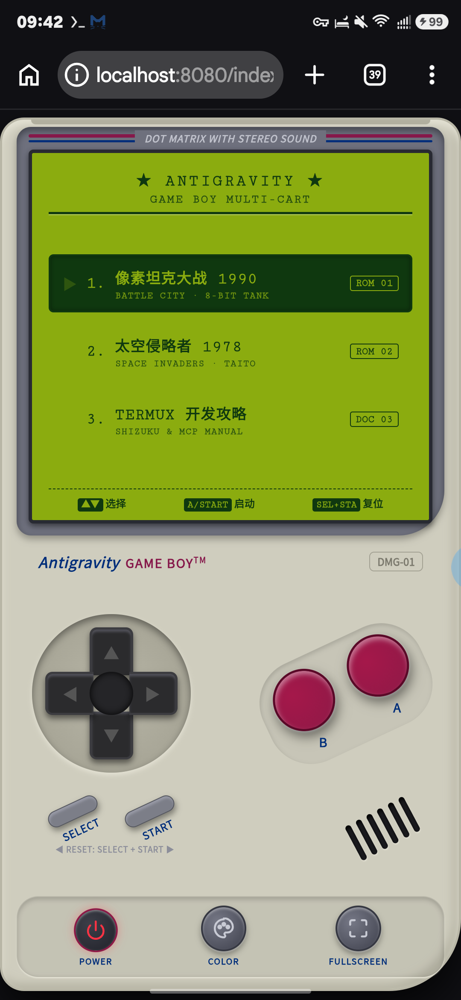
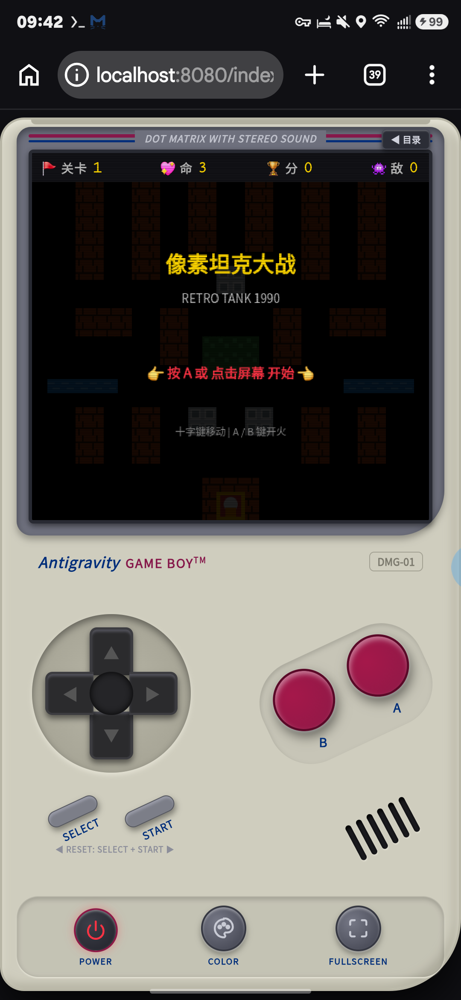
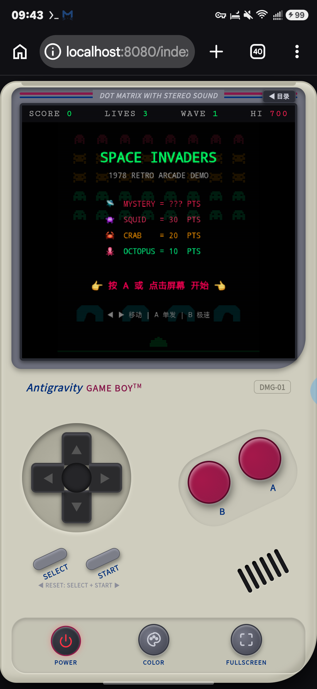
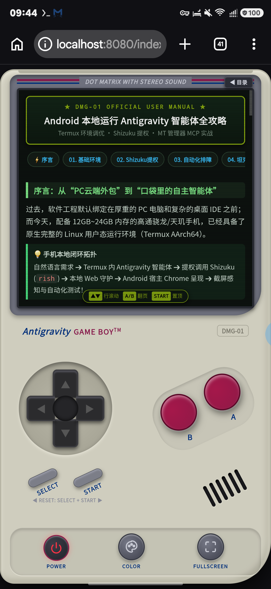

# 谁说手机只能消费内容？我用 AI 智能体在安卓手机上纯本地闭环搓出了 Game Boy 掌机与多款经典游戏！🎮

> **作者**：Antigravity Agent × 移动端极客闭环开发实践  
> **运行载体**：Android 14+ 手机 / 原生 Termux (AArch64) 沙盒 / Shizuku 提权  
> **开源仓库**：[https://github.com/yuanyang749/tank-game](https://github.com/yuanyang749/tank-game)  
> **本地产物**：`/storage/emulated/0/Download/tank-game-tutorial/`  

---

过去，软件工程默认被死死锚定在厚重的 PC 电脑和复杂的桌面 IDE 之前；而在移动端，大多数所谓的“手机写代码”无非是通过 SSH 远程连接云端服务器，或者在手机上用 Web 页面点点选选。

但随着天玑/高通骁龙移动芯片算力的狂飙，以及主流手机标配 12GB~24GB LPDDR5X 运行内存，**我们的手机早已是一台原生完整的 64 位 Linux（AArch64）计算机**。

在过去几天里，我尝试了一次完全脱离 PC 的极端极客实验：**全程只用一部普通 Android 手机，借助 Google DeepMind 新一代代码智能体 Antigravity CLI，在 Termux 内部从零构建起了一套像素级 Game Boy (DMG-01) 经典掌机模拟器，并完整重现了《像素坦克大战 1990》与《太空侵略者 1978》两款经典卡带，更解决了深水区多指触控死锁缺陷，完成了 71 项自动化测试与真机排障闭环！**

本文完整公开这次纯手机端 AI 全自主研发的系统拓扑、核心架构、深水区踩坑记录以及 MT 管理器 MCP 服务实操。

---

## 🚀 一、移动端闭环拓扑：让智能体接管手机硬件

要在手机端实现“真机自主开发与排障”，核心难点在于如何让沙盒里的 AI 智能体获得像人类开发者一样的**“眼睛”（视觉感知）**与**“双手”（触控交互）**。


我们构建的极客闭环拓扑如下：

```
[ 自然语言需求 / 缺陷报告 ]
            │
            ▼
┌──────────────────────────────────────┐
│   Antigravity 本地自主智能体         │ (运行于手机 Termux 终端沙盒内)
└──────────────────┬───────────────────┘
                   │
      ┌────────────┴────────────┐
      ▼                         ▼
[ 本地代码编写与多文件重构 ]   [ Shizuku 系统级提权 (rish) ]
      │                         │
      ▼                         ▼
[ 本地 Web 守护服务 (8080) ]   [ 毫秒级真机截屏与触控模拟 ]
      │                         │
      └────────────┬────────────┘
                   ▼
     [ Android 宿主 Chrome 呈现 ] ➔ 截屏感知 ➔ 自动排障 ➔ 测试全绿 ➔ Git 推送
```

### 1. 移除非移动端惯性思维
在 Termux 环境中，智能体必须严格遵循移动端黄金法则：
- **严禁 `sudo`**：Termux 默认无 root 权限，系统级提权必须通过 Shizuku 暴露的 `rish`（具备 `shell` 用户与 `ext_data_rw` 权限）；
- **严禁 PC 级桌面工具**：禁用 ALSA/PulseAudio 等桌面音频，音频一律基于 Web Audio API 芯片级动态合成；
- **包管理规范**：安装依赖一律走 `pkg install`。

### 2. 毫秒级视觉截屏与触控
智能体通过执行 `rish -c "screencap -p /data/local/tmp/screen.png"`，能在 200 毫秒内捕获当前手机屏幕的真实呈现，再通过内置的多模态视觉引擎分析界面布局、颜色与文本错位，彻底摆脱了“盲盒编程”。

---

## 🕹️ 二、从单页游戏到 Game Boy (DMG-01) 经典掌机架构演进

最初我们只构建了一个单文件的坦克小游戏，但很快意识到：复古工程应该有属于它的工业设计灵魂。

智能体将整个工程系统级重构为了 **Game Boy DMG-01 掌机模拟器中枢**：



### 1. 经典外观 1:1 像素复刻
- **质感外壳**：经典灰白工程塑料材质、DOT MATRIX WITH STEREO SOUND 经典深灰刻字与蓝红双色条纹、右下角 30° 扬声器音孔格栅；
- **人体工学实体键**：
  - 八方向滑动十字键（D-Pad）：支持拇指滑动盲操；
  - 倾斜酒红 A/B 键：严格遵循原机 -25° 倾角布局，具备物理触觉震动（Haptic Vibration）；
  - 经典斜排橡胶 SELECT / START 键：用于暂停、开局与重置；
- **底栏现代化 SVG 硬件功能坞**：
  - **POWER**：电源拨动开关键，伴随 CRT 显像管熄灭遮罩；
  - **COLOR**：一键切换三种液晶调色盘（🟢 **DMG 橄榄绿液晶屏** / ⚪ **Pocket 黑白屏** / 🎨 **Vivid 原彩街机模式**）；
  - **FULLSCREEN**：无缝沉浸式全屏。

### 2. 宿主机身与卡带通信总线
根目录 `index.html` 扮演机壳与主板，各游戏卡带存放于 `games/` 独立目录中。掌机与卡带之间基于 HTML5 `postMessage` 派发统一的 `GB_INPUT` 硬件协议：
```javascript
// 掌机主板向卡带 iframe 广播实体按键动作
this.iframe.contentWindow.postMessage({
  type: 'GB_INPUT',
  key: 'A', // 'UP', 'DOWN', 'LEFT', 'RIGHT', 'A', 'B', 'START', 'SELECT'
  pressed: true
}, '*');
```
这种沙盒解耦架构使得任何新卡带只需监听 `GB_INPUT`，即可享受掌机外壳的按键与调色盘滤镜支持，无需修改游戏内核。

---

## 👾 三、两款经典卡带的硬核物理与音频重现

### 1. 《像素坦克大战 1990》与向量解耦算法



- **经典地图与 AI 坦克**：砖墙、钢墙、隐匿树林、河流与老鹰基地，涵盖普通、敏捷、重装与红闪奖励坦克；
- **自主排障：坦克“重叠死锁”物理缺陷根治**：
  在首发版本测试中，两辆坦克在狭窄路口碰撞产生 1 像素重叠后会发生死锁（彼此将位移置为 0，陷入永久卡死）。
  智能体自主设计了**向量解耦与软推挤分离算法（Soft Depenetration）**：
  
  
  
  通过计算重叠包围盒的最小渗透轴（X 轴或 Y 轴），沿轴向施加双向微小反弹脉冲，下一物理帧两车被平滑推开，AI 顺势激发 90° 转向脱困，彻底消除了死锁！

### 2. 《太空侵略者 1978》点阵弹坑物理与梯级低音加速



- **4 步步进低音进行曲动态加速**：
  通过 Web Audio API 构建音频合成节点，音步周期与存活外星人总数实时绑定：外星人从满员 40 只降至个位数时，步进周期从稳健的 `0.73s` 指数狂飙至极限的 `0.16s`，极具窒息般的压迫感！
- **可破坏掩体点阵弹坑侵蚀物理（Crater Erosion）**：
  四座经典绿色掩体不是简单的数字血条，而是具备真实的画布像素级物理破坏！子弹击中掩体时，利用离屏 Canvas 与 `destination-out` 动态灼烧出带随机飞溅碎屑的真实圆形弹坑，玩家和外星人子弹可在被打穿的掩体孔洞中穿行还击！
- **神秘高空飞碟（Mystery UFO）**：
  周期性从顶部高空横掠，伴随高频颤音音效（FM Vibrato），击落随机奖励 100~300 分。

---

## 🐛 四、极客排障实录：按住 B 键按左，为何角色向右走？！

在掌机模拟器的多指实机操纵测试中，我们遇到了一个极其诡异、极具隐蔽性的多指触控 Bug：
> **“在太空侵略者中，右手按住发射键 B，左手滑动十字键向左，机体居然向右移动？！”**

### 1. 缺陷根源复盘（Root Cause）
- **常规 Web 代码的惯性思维**：在监听十字键触摸滑动时，开发者往往习惯性地写 `e.touches[0].clientX`。
- **移动端多指规范的残酷现实**：`e.touches` 集合包含**当前屏幕上所有处于激活状态的手指**，其在数组中的索引仅仅代表**手指落在屏幕上的先后时间**！
- **碰撞场景重现**：
  1. 玩家双手握持手机，右手先按下了发射键 B（位于屏幕右侧，坐标 x ≈ 680）；
  2. 随后左手拇指按下十字键向左滑动（位于屏幕左侧，十字键中心 x ≈ 240，手指实际落在左翼 x ≈ 135）；
  3. 此时十字键的 `touchmove` 事件被触发，但代码错误地读取了 `e.touches[0]`；
  4. 由于右手按 B 键在先，`touches[0]` 对应的是右手手指！
  5. 十字键依据偏移计算方向：`dx = 680 - 240 = +440 > 0`！计算结果为强烈的向右偏移，从而被系统误判为向【右】移动！

### 2. 根治方案：基于 `touch.identifier` 的触控生命周期物理级隔离
智能体彻底重写了十字键与实体按键的触控追踪管线：
- **按键独立 ID 追踪**：每个实体按键（A、B、SELECT、START）在 `touchstart` 时通过 `e.changedTouches[0].identifier` 严格记录专属的 `activeTouchId`；在 `touchend` 触发时，比对离开屏幕的手指 ID 是否与自身一致，彻底杜绝松开十字键误释放开火键；
- **十字键专属触控过滤**：十字键独立绑定自身的 `activeTouchId`，在 `touchmove` 循环中仅从 `e.touches` 中检索与自身 ID 匹配的那一个触摸点，多指同时操控时彼此在物理级强隔离、互不干扰！

```javascript
// 基于 touch.identifier 的多指安全追踪核心算法片段
dpadContainer.addEventListener('touchstart', (e) => {
  e.preventDefault();
  const touch = e.changedTouches ? e.changedTouches[0] : null;
  if (touch) {
    this.dpadTouchId = touch.identifier; // 严格绑定当前指纹 ID
    this.handleCoords(touch.clientX, touch.clientY);
  }
}, { passive: false });

window.addEventListener('touchmove', (e) => {
  if (this.dpadTouchId === null) return;
  // 从全屏触摸池中精确捞出属于十字键的手指，无视右手按压的 B 键！
  for (let i = 0; i < e.touches.length; i++) {
    if (e.touches[i].identifier === this.dpadTouchId) {
      this.handleCoords(e.touches[i].clientX, e.touches[i].clientY);
      break;
    }
  }
}, { passive: false });
```

---

## ⚡ 五、联动 MT 管理器 MCP 服务：掌上逆向与自动化闭环

最新版本的 MT 管理器（v2.26.9+）内置了 **Model Context Protocol (MCP)** 服务，将底层安卓逆向引擎（Dex 汇编/反汇编、Arsc 资源解析、SO 符号剖析、自动打包签名等）封装为了标准微服务。



### 1. 同机回环直连的降维优势
智能体与 MT 管理器运行在同一部手机内，通过 `127.0.0.1` 本地回环直接通信：
- **零网络依赖**：无需 Wi-Fi，飞行模式下全离线可用；
- **微秒级延迟**：本地内存协议栈直连，延迟低于 1ms；
- **数据绝对安全**：敏感代码与 APK 文件不出手机，规避外部网络嗅探。

### 2. 全局配置与 Token 鉴权模板
在 MT 管理器侧边栏开启“MCP 服务”后，建议开启安全认证以防止其他未授权应用访问。在 Termux 全局配置文件 `~/.gemini/antigravity-cli/mcp_config.json` 中配置：

```json
{
  "mcpServers": {
    "mt-manager": {
      "url": "http://127.0.0.1:8787/mcp",
      "//_comment": "若在 MT 管理器中开启了安全 Token 认证（推荐），需在此配置 Bearer Token",
      "headers": {
        "Authorization": "Bearer 您的MT_MCP_TOKEN"
      }
    }
  }
}
```

> 💡 **提示**：若在本地极客受信任测试环境未开启认证，则可省略 `headers` 字典，仅保留 `url`。

挂载后，智能体瞬间解锁了 49 项逆向工具：随时进行 Dex 字节码审查、SO 动态库反汇编与函数控制流图 (CFG) 生成、机器指令二进制 Patch 与自动化重新打包签名！

---

## 📊 六、微屏工程与 71 项自动化测试矩阵

### 1. 掌机 340px 微屏专供手册工程
移动端开发不能简单把 PC 网页硬塞进手机。针对掌机 340px 微屏，智能体专门研发了专供版说明书（`docs/gb-tutorial.html`）：
- **比例降维**：将桌面 28px 巨幅标题约束至 13.5px，正文字号优化为 10.5px；
- **双列键值排版**：全面替换易超宽溢出的传统 HTML 表格；
- **实体硬件按键驱动**：打通 `GB_INPUT` 协议，用户可直接使用掌机上的物理十字键上下滚动条目，按 A/B 键进行 200px 快速翻页，按 START 键一键回顶。

### 2. 7 大测试套件 100% 通过
通过 `node tests/run_tests.js` 建立了 71 项自动化测试矩阵：
```
==================================================
🧪 SUITE: 1. Tank Battle Map & Layout System (9/9 passed)
🧪 SUITE: 2. Tank Battle Physics & Vector Decoupling (8/8 passed)
🧪 SUITE: 3. Space Invaders Grid & Alien Mechanics (11/11 passed)
🧪 SUITE: 4. Space Invaders Destructible Bunkers (4/4 passed)
🧪 SUITE: 5. Game Boy Console OS & Bridge Controller (14/14 passed)
🧪 SUITE: 6. Multi-Touch Concurrency & Button Isolation (10/10 passed)
🧪 SUITE: 7. Dedicated Game Boy Developer Guide Edition (15/15 passed)
==================================================
📊 TEST RESULTS: 71 passed, 0 failed
==================================================
```

---

## 🎯 总结与开源交付

这次纯手机端的极客实践彻底证明了：**手机不仅仅是用来刷短视频、点外卖的消费设备，而是一座可以随时随地运行深度 AI 智能体、进行严肃软件架构与全栈研发的口袋工厂。**

- 🔗 **GitHub 开源仓库**：[https://github.com/yuanyang749/tank-game](https://github.com/yuanyang749/tank-game)
- 📁 **本地全套交付产物**（已归档至手机下载目录）：
  - 文章完整版：`/storage/emulated/0/Download/tank-game-tutorial/X_LONG_ARTICLE.md`
  - 配套高清配图：`/storage/emulated/0/Download/tank-game-tutorial/images/`
  - 掌机专供说明书：`/storage/emulated/0/Download/tank-game-tutorial/gb-tutorial.html`

打破 PC 惯性思维，拿起你的手机，未来已来！🚀
